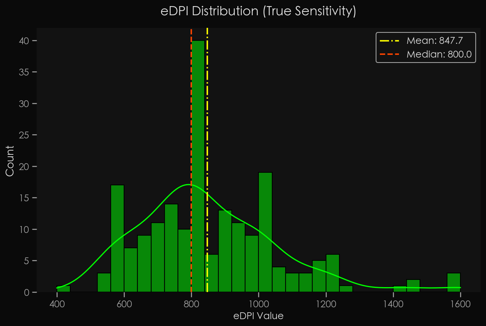
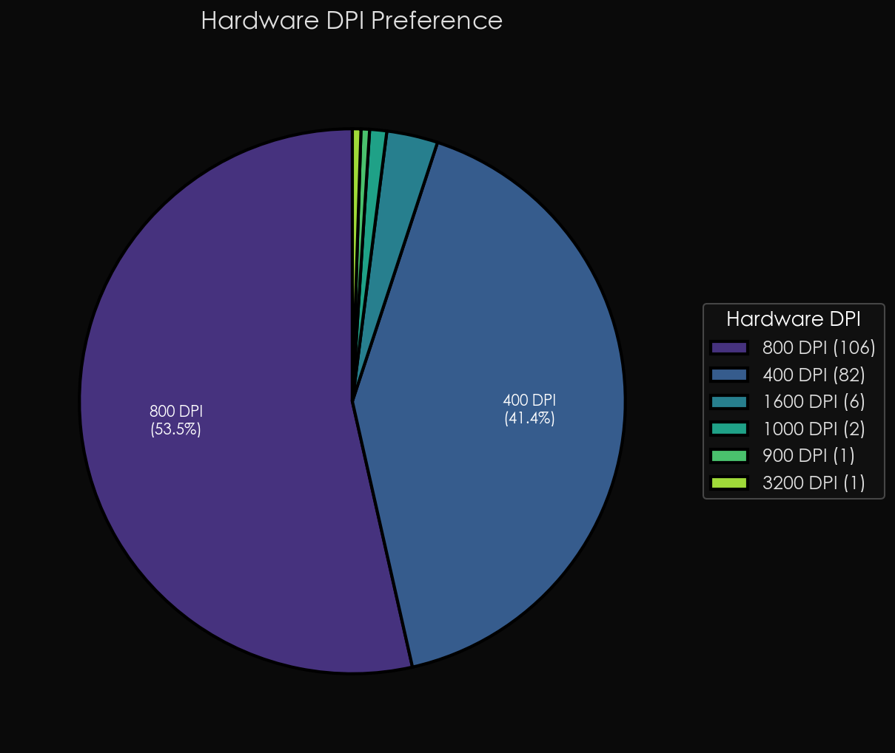
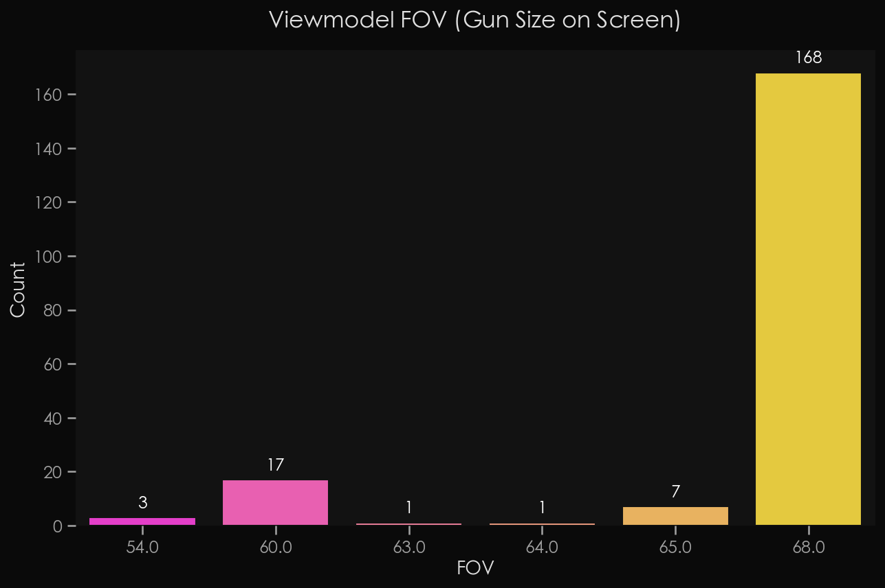
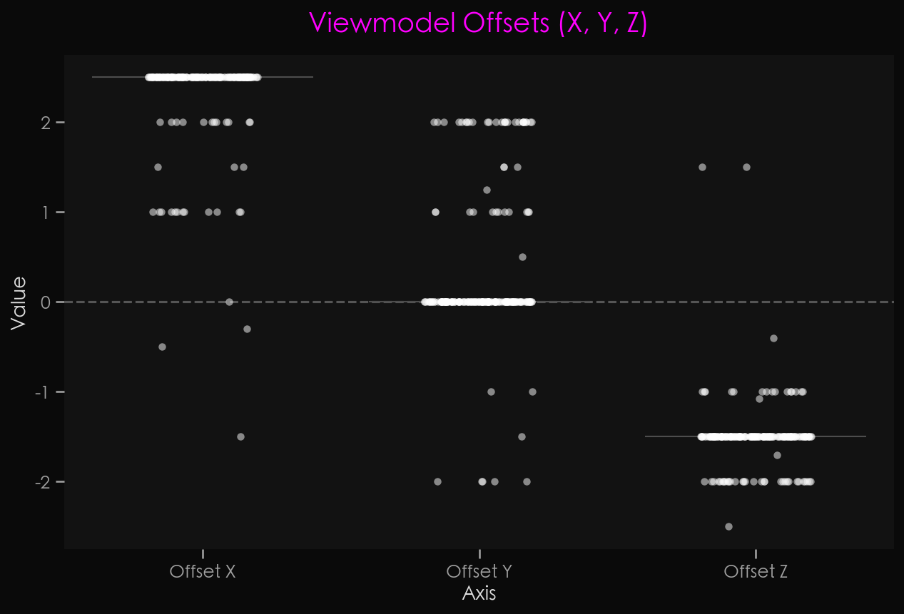
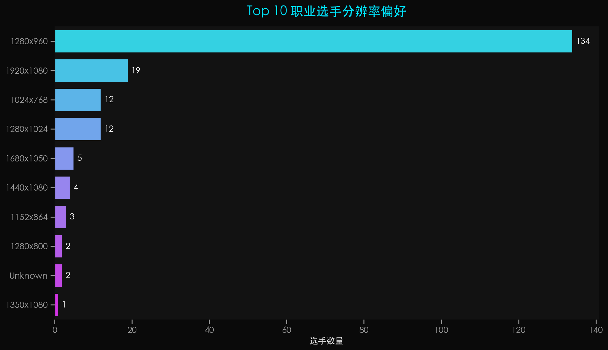
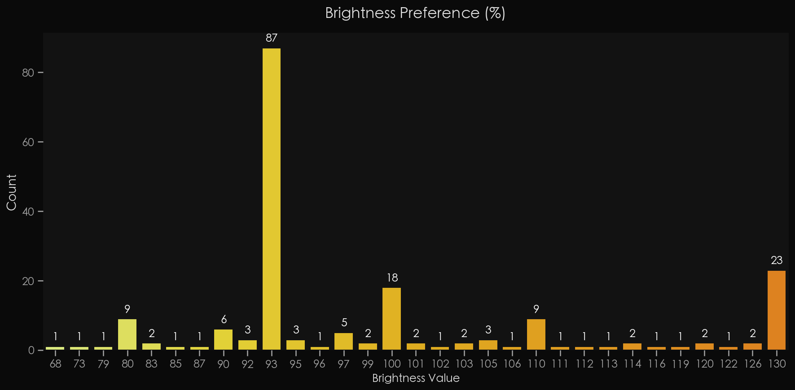
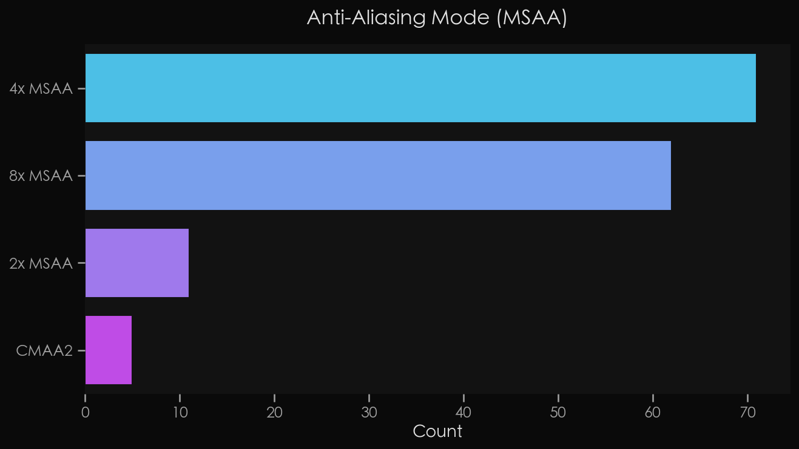

# 2026 CS 顶级职业选手设置白皮书：基于 184 名顶尖 Pro 的纯净数据解析

## 📊 一、 项目背景与数据样本

*   **采集时间**：2026 年 3 月
*   **数据来源**：39 支核心战队（涵盖 HLTV Top 30 及 9 支精选高价值战队）。
*   **样本数量**：初始大名单 195 人，经过严格清洗（剔除外设参数不全的无效数据）后，保留了 **184 名顶级职业选手的 100% 纯净数据**。

---

## ⏱️ 二、 太长不看：2026 职业赛场“省流版”结论

*(注：以下结论基于 184 名一线战队选手纯净数据客观得出)*

**Q1：职业选手的 eDPI（真实灵敏度）具体分布是怎样的？**
*   **省流结论**：核心区间集中在 600 - 1000。当前职业赛场的**中位数是 800 eDPI**，受少部分高敏选手影响，平均值为 870 eDPI。800 左右是目前的“绝对基准线”。

**Q2：鼠标 DPI 应该怎么选？游戏内 Sens 怎么搭配？**
*   **省流结论**：**800 DPI（占比 51.6%）**已正式取代 400 DPI 成为硬件首选。参数搭配呈现严格的数学守恒：为了将最终的手感（eDPI）维持在 800 左右的核心区间，坚守 400 DPI 的选手 Sens 普遍高于 1.0；而选用 1600 及以上 DPI 的选手，其游戏内 Sens 则被百分之百向下压缩至 1.0 以下。

**Q3：显示器刷新率（Hz）和游戏内最高帧数（FPS）门槛多高？**
*   **省流结论**：144Hz 在顶级赛场彻底绝迹，**360Hz 仅为基础底线**。近四成选手已跨入 540Hz/600Hz 的超高刷时代。帧数限制上，主流共识是输入 `fps_max 0`（不限制），极致压榨显卡性能。

**Q4：职业哥的准星有什么特点？**
*   **省流结论**：准星主打“极简微缩”，**86.3% 选手同时关闭中心点和外轮廓线**。颜色首选默认的绿、青两色；而在使用自定义（Custom）颜色的阵营中，纯白、纯绿以及高辨识度且护眼的**“冰薄荷色”**（如 RGB 0,255,145）最受欢迎。

**Q5：持枪视角（Viewmodel）大家都是怎么设置的？**
*   **省流结论**：“极限藏枪”已有标准答案。**85% 的选手使用最高视场角 `viewmodel_fov 68`**，并配合三轴偏移量 `X=2.5, Y=0, Z=-1.5`，统一将武器模型极致压缩在屏幕的最右下角。

**Q6：分辨率比例是否要拉伸？亮度怎么选？**
*   **省流结论**：“4:3 邪教”依然具备绝对统治力（占比 78.3%）。其中 **`1280x960`** 是一线赛场最具统治力的标配分辨率（高达 126 人使用）。此外，画面亮度的“最完美甜点位”被高度统一在 **`93%`**。

**Q7：高级画质特效（阴影、抗锯齿、粒子）怎么取舍？**
*   **省流结论**：核心法则是“扫除无效视觉干扰”。**全局阴影必开 `High（高）`**（为了获取敌方影子信息），着色器与粒子细节则双双拉到最低（防止光污染）；抗锯齿标配 `4x MSAA` 消除拉伸画面的狗牙，贴图过滤首选最基础的“双线性（Bilinear）”。

**Q8：雷达（小地图）参数怎么设大局观最好？**
*   **省流结论**：绝大多数选手追求“一眼看清全图”，雷达**缩放比例集中在 `0.4` 左右**。此外，职业赛场上拥有高达 98% 的绝对共识：开启“雷达随视角旋转”并且“雷达始终以玩家为中心”。

---

## 🎯 三、 深度数据解析（八大核心问题）

### 战区一：鼠标与控枪玄学

#### Q1：职业选手的 eDPI（真实灵敏度）具体分布是怎样的？

根据真实数据分布来看，2026 年顶级职业选手的 eDPI 呈现出标准的正态偏右分布规律。绝大部分职业选手的 eDPI 集中在 **600 至 1000** 之间。当前顶级赛场的 **eDPI 中位数精确落在 800**，而平均值为 870。

800 eDPI 是目前赛场上最主流的“标准答案”（直方图中频数最高）。尽管有极少数“手臂流”选手下探至 500 左右，或“手腕流”选手上拉至 1400-1600 区间，但整体均值被高敏选手略微拉高。对于普通玩家而言，**800 - 870 eDPI 是最具参考价值的黄金区间**。

#### Q2：鼠标 DPI 和游戏内 Sensitivity 该怎么搭配？

结合数据我们可以清晰地看到当前外设参数的迭代趋势：**800 DPI 成功夺权**。在硬件 DPI 的选择上，800 DPI 以 51.6% 的占比占据绝对统治地位，传统的 400 DPI 虽然仍是中流砥柱，但以 42.4% 的占比退居二线。

在参数搭配上，散点图揭示了严格的数学守恒规律：为了将最终的 eDPI（真实手感）维持在 800 左右的核心区间，坚守 400 DPI 的选手游戏内 Sens 必然远超 1.0（集中在 1.3 - 4.0 之间）；采用主流 800 DPI 的选手，Sens 开始紧密围绕 1.0 阈值上下波动；而选用 1600 及以上 DPI 的选手，其游戏内 Sens **100% 严格控制在 1.0 之下**。

---

### 战区二：硬件门槛

#### Q3：显示器刷新率（Hz）和游戏内帧数限制（FPS）大家是怎么选的？

这两张图直观地展现了 2026 年职业赛场的“硬实力”门槛。**144Hz 在顶级赛场已被彻底淘汰**（仅剩 1 人使用），**360Hz 成为基础底线**（使用人数最多，达 61 人）。最令人瞩目的是，高达 46 名选手已经跨入 600Hz 的超高刷时代。

在游戏内最大帧数限制上，职业哥的态度高度一致：**最高优选是不限制（fps_max 0）**，共有 65 名选手采用该设置，占据断层第一。主流策略依然是“让显卡跑满”，通过压榨极致帧数来换取更低的游戏底层画面生成延迟。

---

### 战区三：视觉欺骗（准星与持枪视角）

#### Q4：职业哥的准星有什么特点？

准星是 FPS 游戏中最核心的视觉交互元素。高达 **86.3% 的选手同时关闭了中心点（Dot）和准星轮廓线（Outline）**。这意味着纯粹的十字准星才是最终答案。绝大部分准星大小数据点集中在负数 Gap（间距 -4 到 -2 之间）以及中短 Length（长度 1.0 到 3.0 之间）的区域，“紧凑型、小缝隙”是绝对主流。

如果在游戏默认的 UI 颜色池中做选择，绿色依然是毋庸置疑的信仰级首选，青色紧随其后。但大量选手（约 58 人）选择深入 RGB 底层寻找最适合自己的高反差色彩。其中，**纯白 RGB(255,255,255)** 是最多人使用的颜色；此外，介于青色和绿色之间的**“冰蓝色/薄荷绿”**（如 RGB 0,255,145）能在保证高辨识度的同时，大幅降低长时间盯视屏幕带来的视觉疲劳。

#### Q5：持枪视角（Viewmodel）大家都是怎么设置的？

在顶级赛场上，每一寸视野都关乎生死。**高达 156 人（占比约 85%）选择了满值 `viewmodel_fov 68`**，这可以使手臂和武器模型在视觉上拉远并变小。

结合 XYZ 轴偏移量，当前版本最无可争议的 Viewmodel 黄金公式即为 **`X=2.5, Y=0, Z=-1.5` 配合 `FOV=68`**。这套设置能将武器模型极限压缩在屏幕的右下角，彻底消除枪管或手臂对中低视野的遮挡。

---

### 战区四：显卡与画质调校

#### Q6：分辨率比例是否要拉伸？亮度怎么选？

**78.3% 的职业选手依然是坚定的 4:3 比例拥趸**。原生 16:9 比例仅占据 10.3% 的微弱份额。在具体分辨率上，**高达 126 名选手统一使用了 `1280x960` 分辨率**，形成了断崖式的领先。它是 4:3 比例下画面清晰度与帧数压榨之间的“最完美甜点位”。

在亮度设置中，多达 **82 名选手精确地将亮度锁定在了 `93%`**。这说明在当前游戏引擎的光影渲染下，93% 是一个能够完美兼顾“看清暗处老六”且“面对高光区域不至于过度刺眼”的绝佳平衡点。

#### Q7：高级画质设置中，光影、抗锯齿、粒子特效是怎么取舍的？

在高级视频设置中，职业哥的取舍逻辑极其清晰：“一切为了战术视野让路”。
1.  **全局阴影**：**高达 106 名选手设定为 `High（高）`**。动态阴影是极其关键的战术信息，这是职业哥宁可牺牲帧数也绝不妥协的设置。
2.  **着色器与粒子细节**：双双被压制在了 **`Low（低）`** 的极限值。统统拉低能减少光污染，让你在混烟和直视燃烧弹时拥有更干净的视野。
3.  **抗锯齿**：**`4x MSAA` 是最主流的选择**。由于 1280x960 拉伸画面会放大像素，4x 到 8x MSAA 是低分辨率下保证远距离索敌清晰度的“硬性挂载”。
4.  **贴图过滤模式**：最基础的 **`Bilinear（双线性过滤）`** 占据压倒性优势，进一步榨干显卡的最后一点帧数。

---

### 战区五：大局观天眼（雷达设置）

#### Q8：雷达和 HUD 职业选手们有什么偏好？

雷达是捕捉敌方走位、判断战局重心的“天眼”。
*   **雷达缩放比例**：最密集的数据落在 **`0.4` 到 `0.45` 的区间**。绝大部分职业哥的诉求是“一眼看清整张地图”。
*   **雷达是否旋转**：高达 **98.0% 的职业选手开启了“雷达随视角旋转”**功能，这种直观反馈能让空间定位达到毫秒级的本能反应。
*   **雷达是否居中**：**88.8% 的选手选择让“雷达始终以玩家为中心”**，这有助于玩家极其精准地判断周围红点与自己的真实距离。