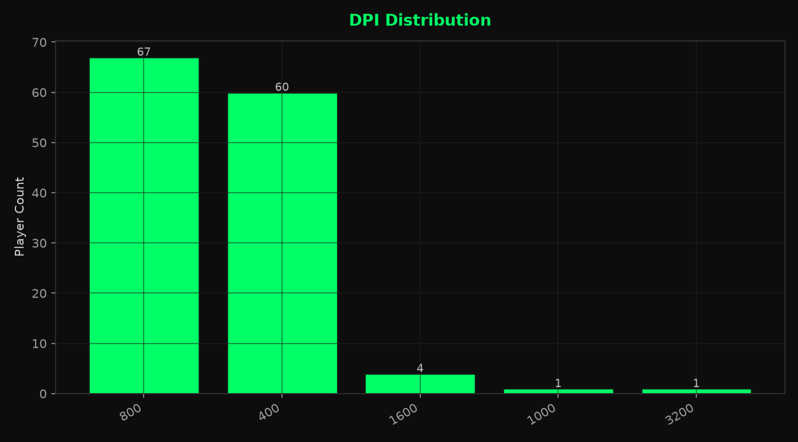
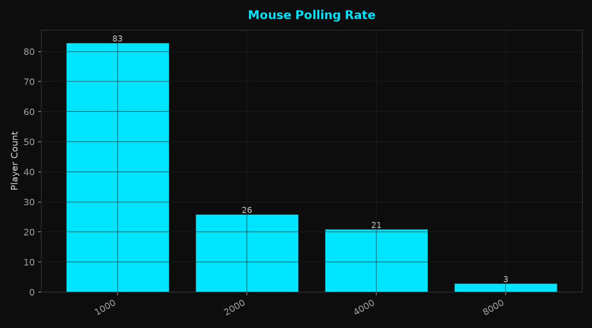
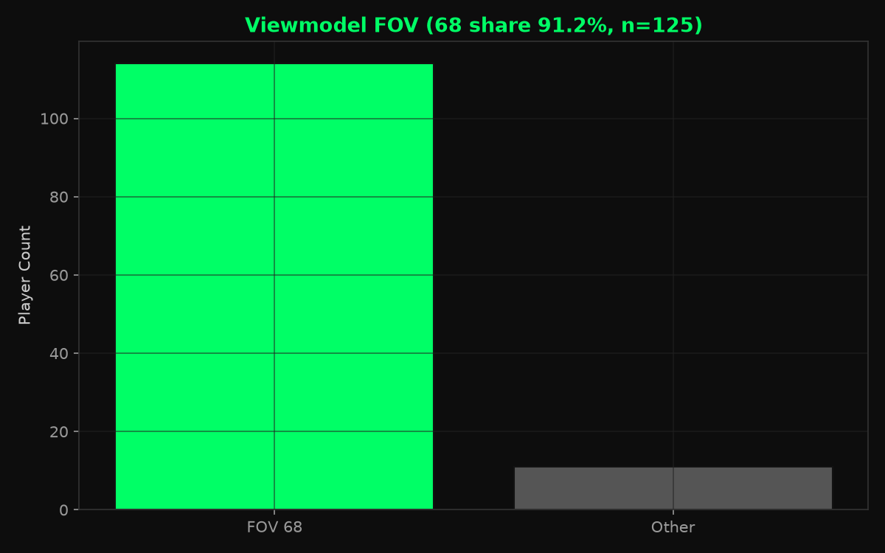

# CS2 职业选手设置月度快照 — 2026-08

[English version](./2026-08.md)

2026-08-11 · VRS Top 30（2026-08-10）· 30 支战队 · 149 名选手 · 设置覆盖 133/149 · `vrs-core-v2` baseline

## 1. 本期核心数据

- 中位 eDPI：**800**（n=133）
- DPI：800 占 50.4% · 400 占 45.1%（n=133）
- 4:3：**82.0%**（n=133）
- 1280x960：**68.4%**（n=133）
- 回报率：1000 Hz 占 62.4% · 4000 Hz+ 占 18.0%（n=133）
- 准星：极简占 80.5% · 颜色类别 Custom 占 45.1%（n=133）
- `viewmodel_fov 68`：**91.2%**（n=125）
- Radar centered：开启 71.7%（n=120）

## 2. 鼠标与灵敏度

### eDPI

- 中位数：**800** · 平均值：**844.3** · 有效样本：133
- 600–1000 eDPI 覆盖 69.9% 的有效样本（93/133）。

### DPI

- 800：**50.4%** · 400：45.1% · 1600+：3.8%（n=133）
- 400 与 800 DPI 合计 127/133（95.5%）。

### 鼠标回报率

- 1000 Hz：62.4% · 2000 Hz：19.5% · 4000 Hz：15.8% · 8000 Hz：2.3%（n=133）
- 4000 Hz 及以上合计 24/133（18.0%）。

## 3. 分辨率与显示

### 宽高比

- 4:3：**82.0%**（n=133）
- 16:9 次之，占 11/133（8.3%）。

### 分辨率

- 最常见：**1280x960**（68.4%，n=133）
- 1920x1080 次之，占 12/133（9.0%）。

## 4. 准星

- Dot 与 Outline 同时关闭：**80.5%**（n=133）
- 颜色类别：Custom 45.1% · Cyan 26.3% · Green 22.6% · Yellow 6.0%（n=133）

- Custom RGB：**60/60** 名选手 RGB 三通道完整（100.0%）· 26 种精确颜色 · 最常用 **255,255,255**（25.0%）

## 5. Viewmodel

- `viewmodel_fov 68`：**91.2%**（n=125）
- 最常见三轴偏移：**X=2.5, Y=0, Z=-1.5**

## 6. Radar / 其他

### Radar centered

- 开启比例：71.7%（n=120）

## 7. 扩展样本

| Segment | 战队 | 选手 | eDPI 中位数 |
|---|---:|---:|---:|
| VRS ∩ HLTV Consensus | 27 | 134 | 800 |
| Ranked Union | 32 | 158 | 800 |
| Core + Watchlist | 33 | 163 | 800 |
| All tracked | 35 | 172 | 800 |

## 8. 数据覆盖

| 字段 | valid_n / cohort |
|---|---|
| eDPI | 133 / 149 |
| DPI | 133 / 149 |
| 分辨率 | 133 / 149 |
| 宽高比 | 133 / 149 |
| 准星 | 133 / 149 |
| Viewmodel FOV | 125 / 149 |
| 鼠标回报率 | 133 / 149 |
| 显示器刷新率 | 0 / 149 |
| fps_max | 0 / 149 |
| Radar centered | 120 / 149 |
| Radar rotating | 0 / 149 |

当前 133/149 名 Core 选手至少有一项可用设置字段。

## 9. 数据与代码

- 数据日期：2026-08-11
- 数据来源：cs2settings
- 快照数据：[`data/aggregate/2026-08.json`](../data/aggregate/2026-08.json)
- 项目与方法：[`README.md`](../README.md)
