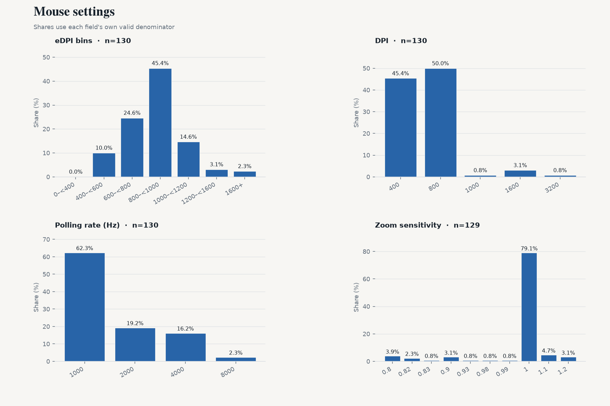
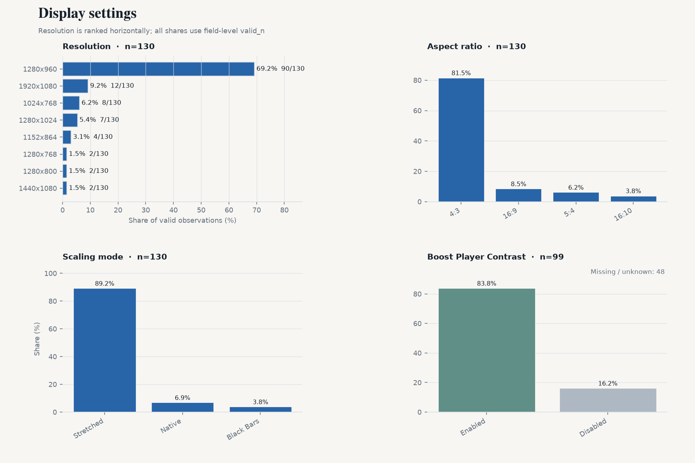
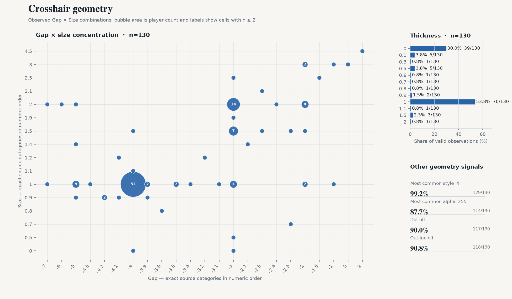
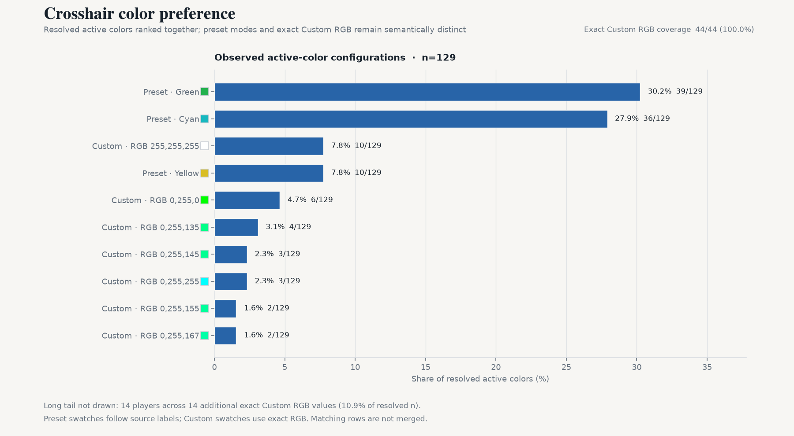
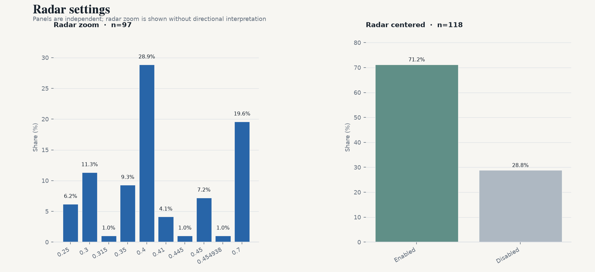

# CS2 职业选手设置月度快照 — 2026-08

[English version](./2026-08.md)

2026-08-30 · VRS Top 30（2026-08-10）· 30 支战队 · 147 名选手 · 设置覆盖 130/147 · `vrs-core-v2`

## 1. 本期要点

- **eDPI 中位数 800**（n=130）
- **4:3** 占 81.5%；**1280x960** 占 69.2%（n=130 / 130）
- **Stretched 缩放**占 89.2%（n=130）
- **1000 Hz 回报率**占 62.3%；4000 Hz+ 占 18.5%（n=130）
- **Dot 与 outline 同时关闭**占 82.3%（n=130）

## 2. 鼠标

- 中位数：**800** · 平均值：**840.4** · 有效样本：130
- 600–1000 eDPI 覆盖 70.0% 的有效样本（91/130）。
- 算术 QC：128/130 一致；按 max(2 eDPI, 1.0%) 容差标记 **2 项**。
- DPI — 800：**50.0%** · 400：45.4% · 1600+：3.8%（n=130）
- 开镜灵敏度 — 中位数 **1**；1 79.1% · 1.1 4.7% · 0.8 3.9%（n=129）
- 回报率 — 1000：62.3% · 2000：19.2% · 4000：16.2% · 8000 Hz：2.3%（n=130）

## 3. 显示

- 宽高比 — 4:3 81.5% · 16:9 8.5% · 5:4 6.2%（n=130）
- 分辨率 — 1280x960 69.2% · 1920x1080 9.2% · 1024x768 6.2%（n=130）
- 缩放模式 — Stretched 89.2% · Native 6.9% · Black Bars 3.8%（n=130）
- Boost Player Contrast — 已开启 **83.8%** （83/99 项已知）；关闭 16/99；缺失/未知 48/147。

## 4. 准星

- Style 原始代码 — 4 99.2% · 5 0.8%（n=130）；仅按来源值报告，不解释机制。
- Size — 中位数 **1**；1 56.2% · 2 16.9% · 1.5 8.5%（n=130）
- Gap — 中位数 **-4**；-4 43.8% · -3 22.3% · -2 6.9%（n=130）
- Thickness — 中位数 **1**；1 53.8% · 0 30.0% · 0.1 3.8%（n=130）
- Alpha — 中位数 **255**；255 87.7% · 200 9.2% · 250 1.5%（n=130）
- Dot 开启 — **10.0%**（13/130 项已知）
- Outline 开启 — **9.2%**（12/130 项已知）
- Dot 与 outline 同时关闭：**82.3%**（n=130，两字段均已知）

- 颜色类别：Custom 34.1% · Green 30.2% · Cyan 27.9% · Yellow 7.8%（n=129）
- Custom RGB：**44/44** 名选手 RGB 三通道完整（100.0%）· 21 种精确颜色 · 最常用 **255,255,255**（22.7%）

## 5. Viewmodel

- `viewmodel_fov 68`：**91.0%**（n=122）
- 最常见三轴偏移：**X=2.5, Y=0, Z=-1.5**

## 6. Radar

- Radar zoom — 中位数 **0.4**；0.4 28.9% · 0.7 19.6% · 0.3 11.3%（n=97）。仅报告数值分布，不作方向性解释。
- Radar centered 开启：71.2%（n=118）

## 7. 扩展样本

| Segment | 战队 | 选手 | eDPI 中位数 |
|---|---:|---:|---:|
| VRS ∩ HLTV Consensus | 27 | 132 | 800 |
| Ranked Union | 32 | 156 | 800 |
| Core + Watchlist | 33 | 161 | 800 |
| All tracked | 35 | 170 | 800 |

## 8. 相比上期

- 上一期：2026-08-11
- Core cohort：149 → 147 名选手
- roster turnover：0.7%
- matched players：147

同选手 matched panel（两期均在样本中的选手）：
- dpi: 0/130 changed
- edpi: 0/130 changed
- resolution: 0/130 changed
- polling_rate: 0/130 changed

## 9. 覆盖与质量

| 字段 | valid_n / cohort |
|---|---|
| eDPI | 130 / 147 |
| DPI | 130 / 147 |
| 开镜灵敏度 | 129 / 147 |
| 鼠标回报率 | 130 / 147 |
| 分辨率 | 130 / 147 |
| 宽高比 | 130 / 147 |
| 缩放模式 | 130 / 147 |
| Boost Player Contrast | 99 / 147 |
| 准星颜色 | 129 / 147 |
| 准星 style | 130 / 147 |
| 准星 size | 130 / 147 |
| 准星 gap | 130 / 147 |
| 准星 thickness | 130 / 147 |
| 准星 alpha | 130 / 147 |
| 准星 dot | 130 / 147 |
| 准星 outline | 130 / 147 |
| Viewmodel FOV | 122 / 147 |
| Radar zoom | 97 / 147 |
| Radar centered | 118 / 147 |
| Radar rotating | 0 / 147 |
| 显示器刷新率 | 0 / 147 |
| fps_max | 0 / 147 |

当前 130/147 名 Core 选手至少有一项可用设置字段。
eDPI 算术 QC 在 130 项可比较记录中标记 2 项；标记仅作为质量信号，不覆盖来源值。

## 10. 数据与代码

- 数据日期：2026-08-30
- 数据来源：cs2settings
- 快照数据：[`data/aggregate/2026-08.json`](../data/aggregate/2026-08.json)
- 项目与方法：[`README.md`](../README.md)
