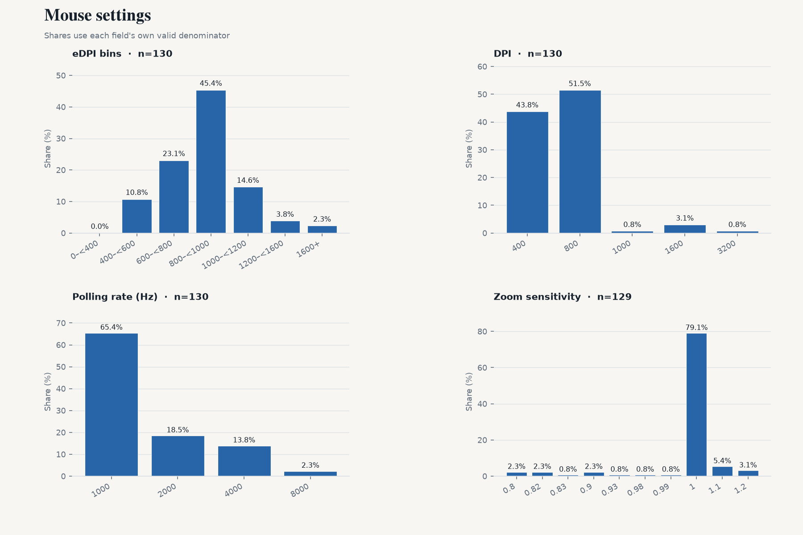
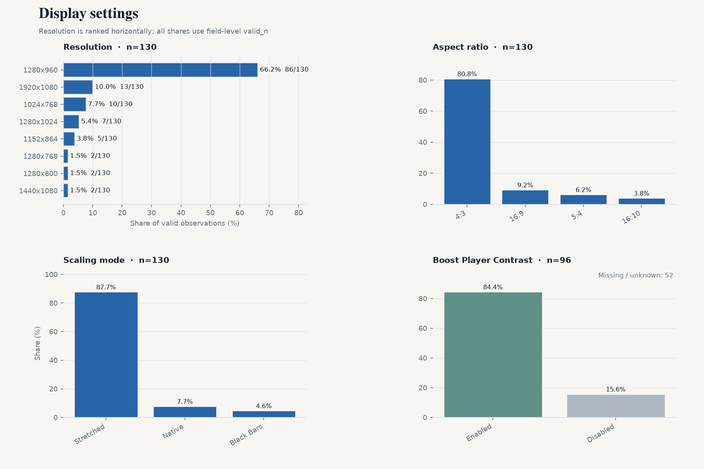
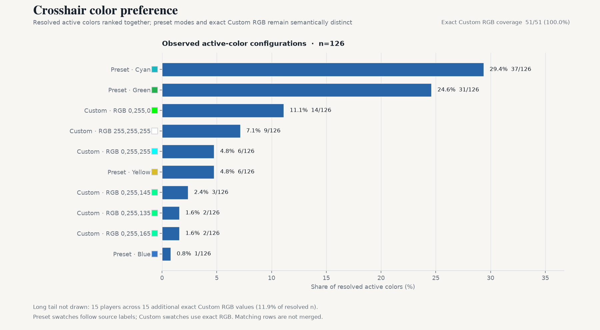

# CS2 Professional Settings Snapshot — 2026-09

[中文版](./2026-09.zh-CN.md)

2026-09-27 · VRS Top 30 (2026-08-10) · 30 teams · 148 players · 130/148 settings · `vrs-core-v2`

## 1. Highlights

- **800 median eDPI** (n=130)
- **4:3** at 80.8%; **1280x960** at 66.2% (n=130 / 130)
- **Stretched scaling** at 87.7% (n=130)
- **1000 Hz polling** at 65.4%; 4000 Hz+ at 16.2% (n=130)
- **Dot + outline both off** for 83.1% (n=130)

## 2. Mouse

- Median: **800** · Mean: **842.9** · n=130
- 600–1000 eDPI covers 68.5% of valid observations (89/130).
- Arithmetic QC: 128/130 consistent; **2 flagged** using max(2 eDPI, 1.0%) tolerance.
- DPI — 800: **51.5%** · 400: 43.8% · 1600+: 3.8% (n=130)
- Zoom sensitivity — median **1**; 1 79.1% · 1.1 5.4% · 1.2 3.1% (n=129)
- Polling — 1000: 65.4% · 2000: 18.5% · 4000: 13.8% · 8000 Hz: 2.3% (n=130)

## 3. Display

- Aspect ratio — 4:3 80.8% · 16:9 9.2% · 5:4 6.2% (n=130)
- Resolution — 1280x960 66.2% · 1920x1080 10.0% · 1024x768 7.7% (n=130)
- Scaling mode — Stretched 87.7% · Native 7.7% · Black Bars 4.6% (n=130)
- Boost Player Contrast — enabled **84.4%** (81/96 known); disabled 15/96; missing/unknown 52/148.

## 4. Crosshair

- Style codes — 4 95.4% · 0 3.8% · 5 0.8% (n=130); source-provided codes, with no mechanism interpretation.
- Size — median **1**; 1 56.2% · 2 16.9% · 1.5 5.4% (n=130)
- Gap — median **-4**; -4 43.1% · -3 18.5% · -5 6.2% (n=130)
- Thickness — median **1**; 1 46.9% · 0 26.2% · 0.5 6.9% (n=130)
- Alpha — median **255**; 255 76.2% · 200 18.5% · 1 3.1% (n=130)
- Dot enabled — **6.2%** (8/130 known)
- Outline enabled — **12.3%** (16/130 known)
- Dot and outline both disabled: **83.1%** (n=130, both fields known)

- Color categories: Custom 40.5% · Cyan 29.4% · Green 24.6% · Yellow 4.8% · Blue 0.8% (n=126)
- Custom RGB: **51/51** players with complete RGB (100.0%) · 21 unique exact colors · top **0,255,0** (27.5%)

## 5. Viewmodel

- `viewmodel_fov 68`: **90.2%** (n=122)
- Dominant offset: **X=2.5, Y=0, Z=-1.5**

## 6. Radar

- Radar zoom — median **0.4**; 0.4 27.6% · 0.7 20.4% · 0.3 11.2% (n=98). Values are descriptive; no directional interpretation is applied.
- Radar centered enabled: 72.7% (n=117)

## 7. Extended segments

| Segment | Teams | Players | Median eDPI |
|---|---:|---:|---:|
| VRS ∩ HLTV Consensus | 27 | 133 | 800 |
| Ranked Union | 32 | 158 | 800 |
| Core + Watchlist | 33 | 162 | 800 |
| All tracked | 35 | 172 | 800 |

## 8. Changes since previous snapshot

- Previous snapshot: 2026-08-11
- Core cohort: 149 → 148 players
- Roster turnover: 0.0%
- Matched players: 148

Matched panel (same players in both snapshots):
- dpi: 0/130 changed
- edpi: 0/130 changed
- resolution: 0/130 changed
- polling_rate: 0/130 changed

## 9. Coverage & quality

| Field | valid_n / cohort |
|---|---|
| eDPI | 130 / 148 |
| DPI | 130 / 148 |
| Zoom sensitivity | 129 / 148 |
| Mouse polling rate | 130 / 148 |
| Resolution | 130 / 148 |
| Aspect ratio | 130 / 148 |
| Scaling mode | 130 / 148 |
| Boost Player Contrast | 96 / 148 |
| Crosshair color | 126 / 148 |
| Crosshair style | 130 / 148 |
| Crosshair size | 130 / 148 |
| Crosshair gap | 130 / 148 |
| Crosshair thickness | 130 / 148 |
| Crosshair alpha | 130 / 148 |
| Crosshair dot | 130 / 148 |
| Crosshair outline | 130 / 148 |
| Viewmodel FOV | 122 / 148 |
| Radar zoom | 98 / 148 |
| Radar centered | 117 / 148 |
| Radar rotating | 0 / 148 |
| Monitor refresh rate | 0 / 148 |
| fps_max | 0 / 148 |

130/148 Core players currently have at least one usable settings field.
eDPI arithmetic QC flags 2/130 comparable observations; flags remain quality signals and do not overwrite source values.

## 10. Data & code

- Snapshot date: 2026-09-27
- Source: cs2settings
- Snapshot data: [`data/aggregate/2026-09.json`](../data/aggregate/2026-09.json)
- Project & methodology: [`README.md`](../README.md)
