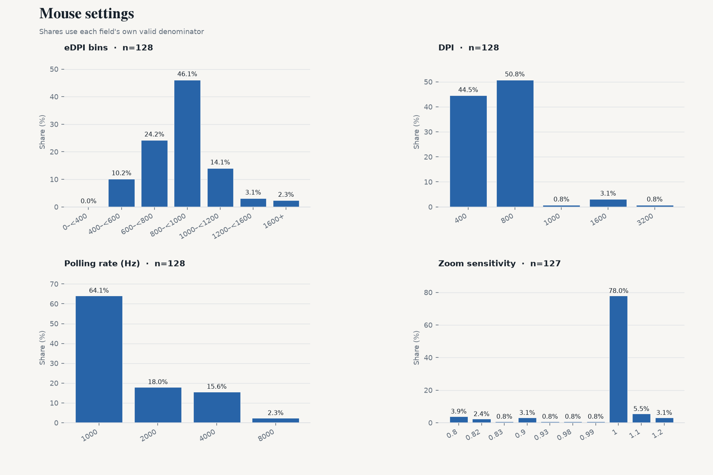
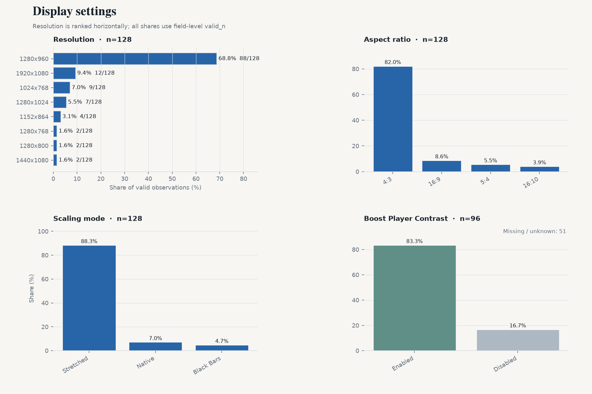
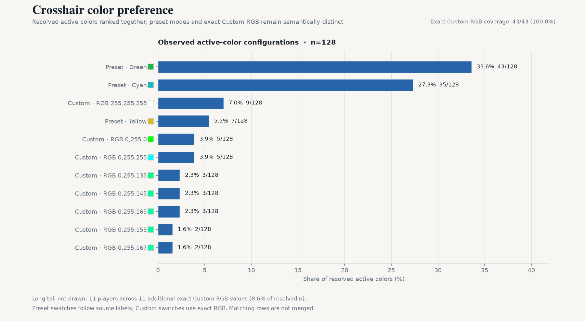

# CS2 职业选手设置月度快照 — 2026-09

[English version](./2026-09.md)

2026-09-06 · VRS Top 30（2026-08-10）· 30 支战队 · 147 名选手 · 设置覆盖 128/147 · `vrs-core-v2`

## 1. 本期要点

- **eDPI 中位数 800**（n=128）
- **4:3** 占 82.0%；**1280x960** 占 68.8%（n=128 / 128）
- **Stretched 缩放**占 88.3%（n=128）
- **1000 Hz 回报率**占 64.1%；4000 Hz+ 占 18.0%（n=128）
- **Dot 与 outline 同时关闭**占 82.0%（n=128）

## 2. 鼠标

- 中位数：**800** · 平均值：**841** · 有效样本：128
- 600–1000 eDPI 覆盖 70.3% 的有效样本（90/128）。
- 算术 QC：127/128 一致；按 max(2 eDPI, 1.0%) 容差标记 **1 项**。
- DPI — 800：**50.8%** · 400：44.5% · 1600+：3.9%（n=128）
- 开镜灵敏度 — 中位数 **1**；1 78.0% · 1.1 5.5% · 0.8 3.9%（n=127）
- 回报率 — 1000：64.1% · 2000：18.0% · 4000：15.6% · 8000 Hz：2.3%（n=128）

## 3. 显示

- 宽高比 — 4:3 82.0% · 16:9 8.6% · 5:4 5.5%（n=128）
- 分辨率 — 1280x960 68.8% · 1920x1080 9.4% · 1024x768 7.0%（n=128）
- 缩放模式 — Stretched 88.3% · Native 7.0% · Black Bars 4.7%（n=128）
- Boost Player Contrast — 已开启 **83.3%** （80/96 项已知）；关闭 16/96；缺失/未知 51/147。

## 4. 准星

- Style 原始代码 — 4 99.2% · 5 0.8%（n=128）；仅按来源值报告，不解释机制。
- Size — 中位数 **1**；1 51.6% · 2 22.7% · 1.5 7.0%（n=128）
- Gap — 中位数 **-4**；-4 43.8% · -3 25.0% · -2 5.5%（n=128）
- Thickness — 中位数 **1**；1 51.6% · 0 32.0% · 0.5 3.9%（n=128）
- Alpha — 中位数 **255**；255 91.4% · 200 5.5% · 250 1.6%（n=128）
- Dot 开启 — **10.2%**（13/128 项已知）
- Outline 开启 — **9.4%**（12/128 项已知）
- Dot 与 outline 同时关闭：**82.0%**（n=128，两字段均已知）

- 颜色类别：Custom 33.6% · Green 33.6% · Cyan 27.3% · Yellow 5.5%（n=128）
- Custom RGB：**43/43** 名选手 RGB 三通道完整（100.0%）· 19 种精确颜色 · 最常用 **255,255,255**（20.9%）

## 5. Viewmodel

- `viewmodel_fov 68`：**90.8%**（n=120）
- 最常见三轴偏移：**X=2.5, Y=0, Z=-1.5**

## 6. Radar

- Radar zoom — 中位数 **0.4**；0.4 29.5% · 0.7 18.9% · 0.3 11.6%（n=95）。仅报告数值分布，不作方向性解释。
- Radar centered 开启：70.7%（n=116）

## 7. 扩展样本

| Segment | 战队 | 选手 | eDPI 中位数 |
|---|---:|---:|---:|
| VRS ∩ HLTV Consensus | 27 | 132 | 800 |
| Ranked Union | 32 | 156 | 800 |
| Core + Watchlist | 33 | 161 | 800 |
| All tracked | 35 | 170 | 800 |

## 8. 相比上期

- 上一期：2026-08-11
- Core cohort：149 → 147 名选手
- roster turnover：0.0%
- matched players：147

同选手 matched panel（两期均在样本中的选手）：
- dpi: 0/128 changed
- edpi: 0/128 changed
- resolution: 0/128 changed
- polling_rate: 0/128 changed

## 9. 覆盖与质量

| 字段 | valid_n / cohort |
|---|---|
| eDPI | 128 / 147 |
| DPI | 128 / 147 |
| 开镜灵敏度 | 127 / 147 |
| 鼠标回报率 | 128 / 147 |
| 分辨率 | 128 / 147 |
| 宽高比 | 128 / 147 |
| 缩放模式 | 128 / 147 |
| Boost Player Contrast | 96 / 147 |
| 准星颜色 | 128 / 147 |
| 准星 style | 128 / 147 |
| 准星 size | 128 / 147 |
| 准星 gap | 128 / 147 |
| 准星 thickness | 128 / 147 |
| 准星 alpha | 128 / 147 |
| 准星 dot | 128 / 147 |
| 准星 outline | 128 / 147 |
| Viewmodel FOV | 120 / 147 |
| Radar zoom | 95 / 147 |
| Radar centered | 116 / 147 |
| Radar rotating | 0 / 147 |
| 显示器刷新率 | 0 / 147 |
| fps_max | 0 / 147 |

当前 128/147 名 Core 选手至少有一项可用设置字段。
eDPI 算术 QC 在 128 项可比较记录中标记 1 项；标记仅作为质量信号，不覆盖来源值。

## 10. 数据与代码

- 数据日期：2026-09-06
- 数据来源：cs2settings
- 快照数据：[`data/aggregate/2026-09.json`](../data/aggregate/2026-09.json)
- 项目与方法：[`README.md`](../README.md)
