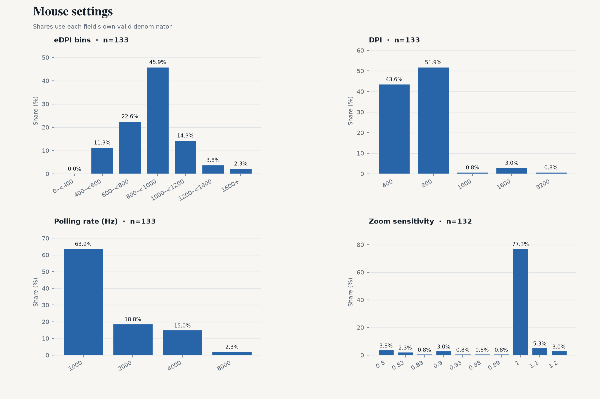
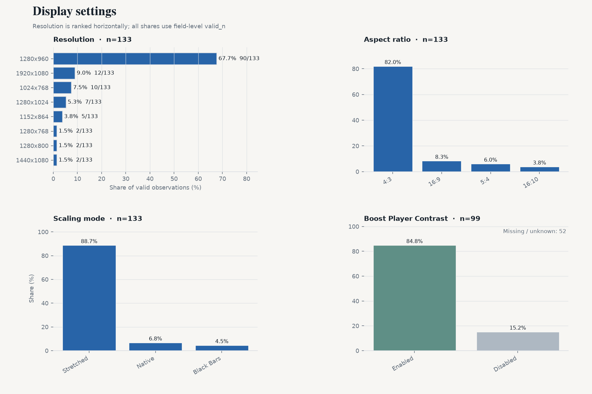
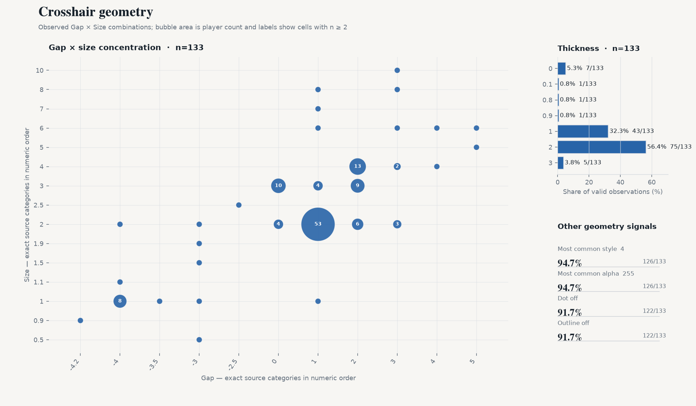
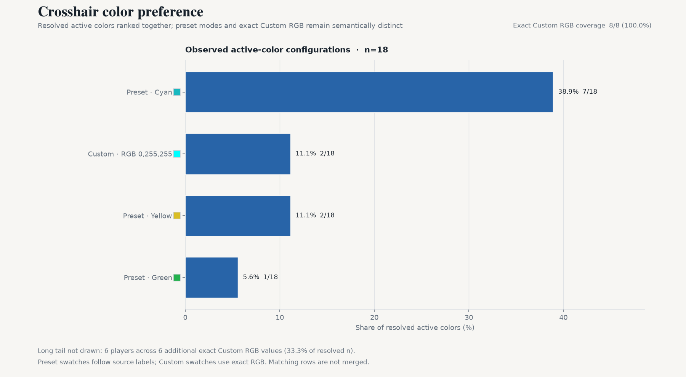
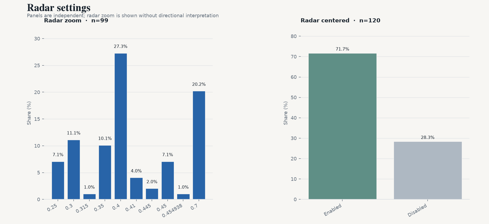

# CS2 职业选手设置月度快照 — 2026-10

[English version](./2026-10.md)

2026-10-04 · VRS Top 30（2026-08-10）· 30 支战队 · 151 名选手 · 设置覆盖 133/151 · `vrs-core-v2`

## 1. 本期要点

- **eDPI 中位数 800**（n=133）
- **4:3** 占 82.0%；**1280x960** 占 67.7%（n=133 / 133）
- **Stretched 缩放**占 88.7%（n=133）
- **1000 Hz 回报率**占 63.9%；4000 Hz+ 占 17.3%（n=133）
- **Dot 与 outline 同时关闭**占 85.0%（n=133）

## 2. 鼠标

- 中位数：**800** · 平均值：**841.1** · 有效样本：133
- 600–1000 eDPI 覆盖 68.4% 的有效样本（91/133）。
- 算术 QC：131/133 一致；按 max(2 eDPI, 1.0%) 容差标记 **2 项**。
- DPI — 800：**51.9%** · 400：43.6% · 1600+：3.8%（n=133）
- 开镜灵敏度 — 中位数 **1**；1 77.3% · 1.1 5.3% · 0.8 3.8%（n=132）
- 回报率 — 1000：63.9% · 2000：18.8% · 4000：15.0% · 8000 Hz：2.3%（n=133）

## 3. 显示

- 宽高比 — 4:3 82.0% · 16:9 8.3% · 5:4 6.0%（n=133）
- 分辨率 — 1280x960 67.7% · 1920x1080 9.0% · 1024x768 7.5%（n=133）
- 缩放模式 — Stretched 88.7% · Native 6.8% · Black Bars 4.5%（n=133）
- Boost Player Contrast — 已开启 **84.9%** （84/99 项已知）；关闭 15/99；缺失/未知 52/151。

## 4. 准星

- Style 原始代码 — 4 94.7% · 3 1.5% · 5 1.5%（n=133）；仅按来源值报告，不解释机制。
- Size — 中位数 **2**；2 51.1% · 3 17.3% · 4 12.0%（n=133）
- Gap — 中位数 **1**；1 45.9% · 2 21.1% · 0 10.5%（n=133）
- Thickness — 中位数 **2**；2 56.4% · 1 32.3% · 0 5.3%（n=133）
- Alpha — 中位数 **255**；255 94.7% · 200 3.0% · 170 0.8%（n=133）
- Dot 开启 — **8.3%**（11/133 项已知）
- Outline 开启 — **8.3%**（11/133 项已知）
- Dot 与 outline 同时关闭：**85.0%**（n=133，两字段均已知）

- 颜色类别：Custom 44.4% · Cyan 38.9% · Yellow 11.1% · Green 5.6%（n=18）
- Custom RGB：**8/8** 名选手 RGB 三通道完整（100.0%）· 7 种精确颜色 · 最常用 **0,255,255**（25.0%）

## 5. Viewmodel

- `viewmodel_fov 68`：**90.4%**（n=125）
- 最常见三轴偏移：**X=2.5, Y=0, Z=-1.5**

## 6. Radar

- Radar zoom — 中位数 **0.4**；0.4 27.3% · 0.7 20.2% · 0.3 11.1%（n=99）。仅报告数值分布，不作方向性解释。
- Radar centered 开启：71.7%（n=120）

## 7. 扩展样本

| Segment | 战队 | 选手 | eDPI 中位数 |
|---|---:|---:|---:|
| VRS ∩ HLTV Consensus | 27 | 136 | 800 |
| Ranked Union | 32 | 161 | 800 |
| Core + Watchlist | 33 | 166 | 800 |
| All tracked | 35 | 176 | 800 |

## 8. 相比上期

- 上一期：2026-08-11
- Core cohort：149 → 151 名选手
- roster turnover：1.3%
- matched players：151

同选手 matched panel（两期均在样本中的选手）：
- dpi: 0/133 changed
- edpi: 0/133 changed
- resolution: 0/133 changed
- polling_rate: 0/133 changed

## 9. 覆盖与质量

| 字段 | valid_n / cohort |
|---|---|
| eDPI | 133 / 151 |
| DPI | 133 / 151 |
| 开镜灵敏度 | 132 / 151 |
| 鼠标回报率 | 133 / 151 |
| 分辨率 | 133 / 151 |
| 宽高比 | 133 / 151 |
| 缩放模式 | 133 / 151 |
| Boost Player Contrast | 99 / 151 |
| 准星颜色 | 18 / 151 |
| 准星 style | 133 / 151 |
| 准星 size | 133 / 151 |
| 准星 gap | 133 / 151 |
| 准星 thickness | 133 / 151 |
| 准星 alpha | 133 / 151 |
| 准星 dot | 133 / 151 |
| 准星 outline | 133 / 151 |
| Viewmodel FOV | 125 / 151 |
| Radar zoom | 99 / 151 |
| Radar centered | 120 / 151 |
| Radar rotating | 0 / 151 |
| 显示器刷新率 | 0 / 151 |
| fps_max | 0 / 151 |

当前 133/151 名 Core 选手至少有一项可用设置字段。
eDPI 算术 QC 在 133 项可比较记录中标记 2 项；标记仅作为质量信号，不覆盖来源值。

## 10. 数据与代码

- 数据日期：2026-10-04
- 数据来源：cs2settings
- 快照数据：[`data/aggregate/2026-10.json`](../data/aggregate/2026-10.json)
- 项目与方法：[`README.md`](../README.md)
