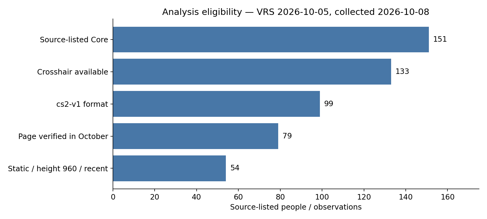
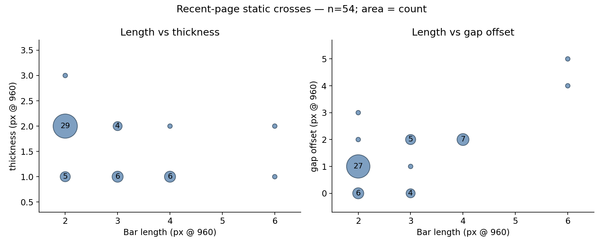

# 2026-10-08 新版职业准星：数据质量与探索性风格分析

本次使用 2026-10-05 Valve 官方 VRS Top 30，按 CS2Settings 当前队伍页收集设置。结果是可复查的文章准备材料和候选快照，不代表已经接受新基线，也不代表全体职业选手的最新实战设置。

## 数据质量结论

数据适合做注明范围的描述性分析和探索性几何分组；尚不适合声称“全部最新现役阵容”“完整新准星参数”或“选手更新后主动选择的设置”。

| 核查 | 结果 | 对分析的影响 |
|---|---|---|
| 采集与队伍映射 | Core 30/30 队伍、151/151 来源列出的成员采集成功 | 这是抓取完整性，不是阵容真实性或设置完整性 |
| 准星覆盖 | 133/151 有准星，18 人无设置，覆盖 88.1% | 缺失分布于 13 支队伍，不能默认随机缺失或把未观察者填成默认准星 |
| 身份、字段范围、未来日期 | 未发现重复 Core 身份、非 Steam 身份、已检查字段的非法值或未来页面日期 | 已解析数据的基本结构可用；不能由此证明来源内容正确 |
| 来源名册 | HEROIC 列出 6 人，其中 1 人缺角色与设置 | 保留候选记录并明确标为待核验，不从排名名单替换来源阵容，不静默删除 |
| 格式 | 99 cs2-v1、21 legacy-v4、13 legacy-v1 | 旧单位不能合并；legacy-v4 是过渡像素格式，不等于旧尺寸单位 |
| 页面核验日期 | 133 条中 90 条为 10 月；99 条 cs2-v1 中 79 条为 10 月 | lastVerified 不代表准星实战使用时间；4 条 cs2-v1 的页面日期早于系统更新，提示转换／时间语义风险 |
| 信息与独立性 | 一个设置主源；完整动态细项、描边颜色、瞄准镜字段尚未提取 | 不能将未提取字段解释为未使用；尚未完成 ProCrosshairs 的全样本核验 |
| 参考排名 | Core 为 10 月 5 日；HLTV 参考仍为 8 月 3 日 | 本文只分析新 VRS Core，不把旧 HLTV 参考当作最新排名 |

缺失设置较多的来源名册包括 FaZe、Inner Circle、Luminosity、magic、Ninjas in Pyjamas，各有 2 人缺失。每支队伍完整计数见公开质量聚合及 notebook。姓名、SteamID、分享码和逐人设置不在公开分析输入中。

## 新格式的选择

仅在 99 条 cs2-v1 中描述：静态十字 94 人，带射击反馈的静态十字 3 人，静态圆和纯点各 1 人；无中心点 93 人，无描边 93 人、全描边 5 人、半描边 1 人；97 人完全不透明，99 人均关闭 T 型。

这些是来源记录的分布，不能据此断言新形状“无用”，也不推断设置优劣或选择动机。

## 几何主样本与常见组合

主样本限定为 cs2-v1、静态十字、页面在 10 月核验、三个几何参数完整，并取其中最大的共同参考高度层：**960 高度，54 人**。另有 21 名近期静态十字记录处于其他高度，不合并进入主模型。

| 长度 / 间距偏移 / 粗细（px @ 960） | 人数 |
|---|---:|
| 2 / 1 / 2 | 22 |
| 2 / 0 / 2 | 6 |
| 4 / 2 / 1 | 6 |
| 2 / 1 / 1 | 4 |
| 3 / 2 / 1 | 4 |

间距是偏移参数，不能直接解读为中心空洞宽度。完整三参数计数保留于 `data/aggregate/analysis/2026-10-08-crosshair.json`；图中的气泡投影会合并第三参数，不代表整套准星相同。

主样本中，长度–粗细 Spearman ρ=-0.550，长度–间距偏移 ρ=+0.546，间距偏移–粗细 ρ=-0.453。不限制页面日期、仍保持同格式／形状／高度的 66 人中，长度–粗细相关仍为负（ρ=-0.531）。这些是描述性关系，不是因果或显著性结论。

## 探索性风格分组

模型仅使用长度、间距偏移和粗细。每项用样本 IQR 缩放，再采用等权曼哈顿距离与 PAM。比较 k=2–5，要求每组至少 max(5,10%样本) 人，再选择轮廓系数最高的方案。

| 候选组 | 算法划入人数 | 代表组合（真实出现的 medoid） | 初步描述 |
|---|---:|---|---|
| 1 | 41 | 2 / 1 / 2 | 较短、较粗、较紧凑 |
| 2 | 13 | 4 / 2 / 1 | 较长、较细、较开阔 |

**41/13 是算法分组人数，不是恰好使用代表组合的人数。** 两组的轮廓系数为 0.660；三组为 0.589；四、五组会形成仅 2 人的小组，未满足最小组规模规则。

50 次固定种子的匿名参数重复采样，ARI 中位数为 1.000、10 分位数为 0.712；提高长度权重后 ARI 为 1.000；对独特模板去重后的两组轮廓系数为 0.608。结果支持继续研究两个候选风格，但不证明存在两种天然职业流派。重复模板可能来自复制或来源转换；匿名参数重复采样也不能检查队内相关性或来源真实性。

颜色、点、描边尚未与公开几何分组联合建模；它们应作为另一层外观标签，而不是让 RGB 主导几何距离。实际游戏渲染、跨高度换算和稀有形状个案还需要单独验证。

## 文章准备的下一步

先核验 HEROIC 名册异常及主要代表准星的实战记录，再补完整分享码参数和渲染。在完成这些核验前，可写“主流仍是静态十字，几何组合存在短粗／长细的分化线索”；不能写命中率提升、某位置必用某风格或新格式代表主动更换设置。

公开候选快照位于 `data/aggregate/2026-10-08.json`，未覆盖 `latest.json` 或正式报告。可执行 notebook 位于 `notebooks/v2/2026-10-08-crosshair.ipynb`，只依赖公开聚合计数；从本地逐人数据生成聚合的代码为 `scripts/crosshair_analysis.py`。字段来源及采集时间保存在本地 `work/`。
