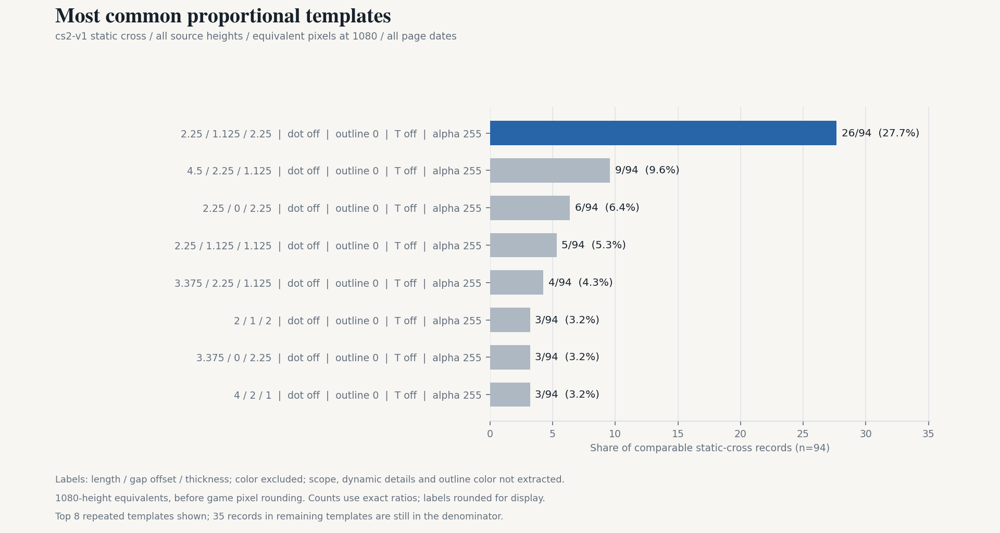
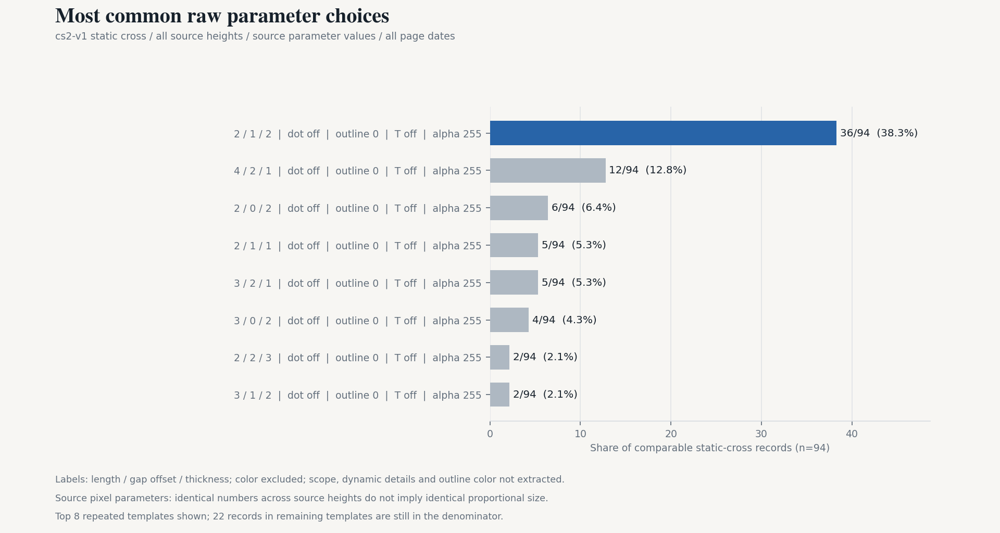
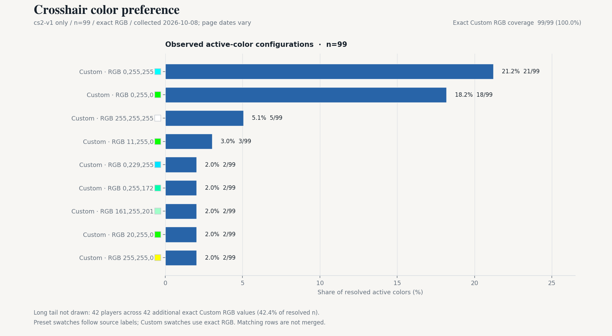

# 2026-10-08 新版职业准星：最常见的准星设置、颜色与数据质量

本次使用 2026-10-05 Valve 官方 VRS Top 30，按 CS2Settings 当前队伍页收集设置。结果是可复查的文章准备材料和候选快照，不代表已经接受新基线，也不代表全体职业选手的最新实战设置。

## 数据质量结论

数据适合做注明范围的描述性分析和探索性几何分组；尚不适合声称“全部最新现役阵容”“完整新准星参数”或“选手更新后主动选择的设置”。

| 核查 | 结果 | 对分析的影响 |
|---|---|---|
| 采集与队伍映射 | Core 30/30 队伍、151/151 来源列出的成员采集成功 | 这是抓取完整性，不是阵容真实性或设置完整性 |
| 准星覆盖 | 133/151 有准星，18 人无设置，覆盖 88.1% | 缺失分布于 13 支队伍，不能默认随机缺失或把未观察者填成默认准星 |
| 身份、字段范围、未来日期 | 未发现重复 Core 身份、非 Steam 身份、已检查字段的非法值或未来页面日期 | 已解析数据的基本结构可用；不能由此证明来源内容正确 |
| 来源名册 | HEROIC 列出 6 人，其中 1 人缺角色与设置 | 保留候选记录并明确标为待核验，不从排名名单替换来源阵容，不静默删除 |
| 格式 | 99 cs2-v1、21 legacy-v4、13 legacy-v1 | 旧单位不能合并；legacy-v4 是过渡像素格式，不等于旧尺寸单位 |
| 页面核验日期 | 133 条中 90 条为 10 月；99 条 cs2-v1 中 79 条为 10 月 | lastVerified 不代表准星实战使用时间；4 条 cs2-v1 的页面日期早于系统更新，提示转换／时间语义风险 |
| 信息与独立性 | 一个设置主源；完整动态细项、描边颜色、瞄准镜字段尚未提取 | 不能将未提取字段解释为未使用；尚未完成 ProCrosshairs 的全样本核验 |
| 参考排名 | Core 为 10 月 5 日；HLTV 参考仍为 8 月 3 日 | 本文只分析新 VRS Core，不把旧 HLTV 参考当作最新排名 |

缺失设置较多的来源名册包括 FaZe、Inner Circle、Luminosity、magic、Ninjas in Pyjamas，各有 2 人缺失。每支队伍完整计数见公开质量聚合及 notebook。姓名、SteamID、分享码和逐人设置不在公开分析输入中。

## 新格式的选择

仅在 99 条 cs2-v1 中描述：静态十字 94 人，带射击反馈的静态十字 3 人，静态圆和纯点各 1 人；无中心点 93 人，无描边 93 人、全描边 5 人、半描边 1 人；97 人完全不透明，99 人均关闭 T 型。

这些是来源记录的分布，不能据此断言新形状“无用”，也不推断设置优劣或选择动机。

## 重筛：全部参考高度纳入，主样本为 94 人

本次不再限定参考高度 960，也不以页面核验日期剔除主样本。99 条 cs2-v1 中，94 条静态十字的已提取外观参数和参考高度完整，全部纳入尺寸比较，来自 **22 支战队**。其他 5 条为带射击反馈的十字 3、静态圆 1、纯点 1，保留在形状分布中，单独分析。

| Valve 10 月 5 日战队排名 | 94 人主样本人数 |
|---|---:|
| 1–10 | 41（43.6%） |
| 11–20 | 23（24.5%） |
| 21–30 | 30（31.9%） |

这是 VRS 全球 Top30 战队来源名册中的职业选手样本，不是按个人知名度选择。原先未纳入尺寸比较的 ZywOo、ropz、Twistzz、XANTARES、device 等现在均满足条件。阵容归属按来源页记录，仍需独立审核；HLTV 快照为 8 月 3 日，不用作当前排名宣传。

来源参考高度包括：960（66）、1080（13）、768（5）、1024（4）、1050（2）、864（2）、900（1）、800（1）。其中 75 条页面在 10 月核验，另 19 条保留在主样本中；75 条另作时效敏感性检查。页面日期不是实战观察日期。

## 统一尺度的方法

[Valve 9 月 24 日说明](https://steamcommunity.com/games/CSGO/announcements/detail/1844751498219795)明确新准星像素随分辨率变化按比例缩放。本分析使用：**等效参数 = 原始参数 × 1080 / screenHeight**，对长度、间距偏移和粗细分别换算；点、描边模式、T 型和 alpha 保持来源值。

1080 只是展示单位，不是纳入条件，换成另一共同高度不会改变比例相同的分组人数。使用精确分数判定相等，图中文字取小数仅为显示，不按四舍五入合并相近组合。

这些是游戏取整之前的连续等效参数，**不是游戏实际渲染像素，也不是可以直接输入的“小数配置”**。间距偏移不直接解释为中心空洞宽度。不模拟 4:3 拉伸、物理显示器尺寸、实际像素取整或完整描边渲染；未提取的字段不参与“相同模板”判定。

## 推荐依据：原始设置与等比例模板分开

| 统计口径 | 最常见组合 | 人数 |
|---|---|---:|
| 原始参数相同，不要求相对尺度相同 | 长度 2 / 间距偏移 1 / 粗细 2，无点、无描边、非 T 型、alpha 255 | 36/94（38.3%） |
| 相同相对尺度及已提取外观 | 1080 等效值 2.25 / 1.125 / 2.25，无点、无描边、非 T 型、alpha 255 | 26/94（27.7%） |
| 同口径，仅 10 月核验页面 | 上述等比例模板 | 22/75（29.3%） |

最常见等比例模板的 26 条都来自原始参考高度 960，对应可读的来源配置为 **2 / 1 / 2 @ 960**。可以介绍为“本样本最常见的小型静态十字起点”，不能写成“大多数职业选手使用完全相同的准星”。原始参数相同的 36 人也不能一概宣称外观大小相同。

完整外观仅指已提取的形状、三个尺寸参数、中心点、描边模式、T 型及 alpha。RGB 不参与模板排名；瞄准镜、完整动态细项及描边颜色未提取。只出现一次的完整外观组合不逐个公开，保留汇总人数。

## 颜色保持独立选择

全部 99 条新版记录都有 RGB：精确青色 RGB 0,255,255 为 **21/99（21.2%）**，绿色 RGB 0,255,0 为 **18/99（18.2%）**，白色为 5/99。仅取 79 条 10 月核验页面时，青色与绿色各 15/79（19.0%）。近似青绿的变体按精确 RGB 分开；颜色图复用仓库生产绘图代码，长尾保留在分母中。

最常见等比例模板的 26 条中，青色 7/26、绿色 4/26、白色 2/26，其余 13/26。不能把总体颜色份额与模板份额相乘推算真实整套人数。

## 补充关联与此前同高度分析

统一尺度的 94 人中，长度–粗细 Spearman ρ=-0.388，长度–间距偏移 ρ=+0.582，间距偏移–粗细 ρ=-0.235。这是描述性关联，不是因果、选择动机或瞄准效果证据。

此前限定参考高度 960 且页面在 10 月核验的 54 人，仍作为附录子样本保留：最常见外观 22/54，长度–粗细 ρ=-0.550。探索性几何两组人数 41/13，代表参数 2/1/2 与 4/2/1；分组人数不等于代表模板实际使用人数，不作为此次全高度分析的主结果，也不声称天然职业流派。

## 文章介绍建议

> 我们整理了 Valve 全球排名前 30 战队的新版准星记录：99 名选手有新版数据，其中 94 名使用静态十字。为了比较不同分辨率参考高度下的尺寸，我们将参数统一到相同尺度，观察最常见的外观组合，并另列颜色选择。

需核验 HEROIC 来源名册及实战使用记录，继续补全缺失参数。当前候选、匿名聚合、图和 notebook 可复查，尚未接受正式准星基线或发布文章。数据采集成功不代表所有阵容和设置均为最新实战状态。
