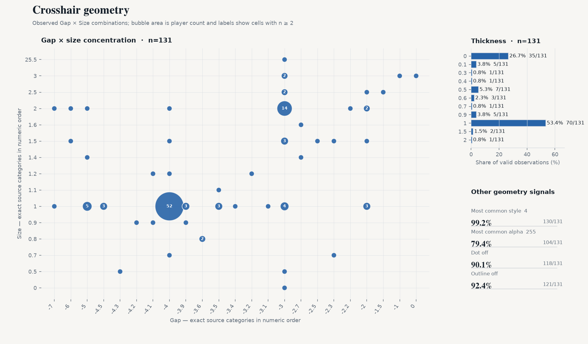
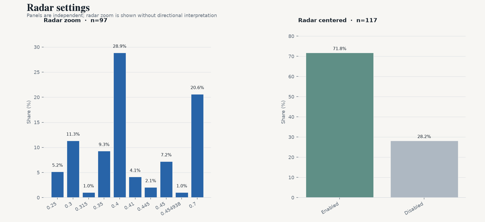

# CS2 Professional Settings Snapshot — 2026-08

[中文版](./latest.zh-CN.md)

2026-08-23 · VRS Top 30 (2026-08-10) · 30 teams · 147 players · 131/147 settings · `vrs-core-v2`

## 1. Highlights

- **800 median eDPI** (n=131)
- **4:3** at 81.7%; **1280x960** at 68.7% (n=131 / 131)
- **Stretched scaling** at 89.3% (n=131)
- **1000 Hz polling** at 61.8%; 4000 Hz+ at 18.3% (n=131)
- **Dot + outline both off** for 83.2% (n=131)

## 2. Mouse

- Median: **800** · Mean: **843.1** · n=131
- 600–1000 eDPI covers 69.5% of valid observations (91/131).
- Arithmetic QC: 129/131 consistent; **2 flagged** using max(2 eDPI, 1.0%) tolerance.
- DPI — 800: **50.4%** · 400: 45.0% · 1600+: 3.8% (n=131)
- Zoom sensitivity — median **1**; 1 78.5% · 1.1 4.6% · 0.8 3.8% (n=130)
- Polling — 1000: 61.8% · 2000: 19.8% · 4000: 16.0% · 8000 Hz: 2.3% (n=131)

## 3. Display

- Aspect ratio — 4:3 81.7% · 16:9 8.4% · 5:4 6.1% (n=131)
- Resolution — 1280x960 68.7% · 1920x1080 9.2% · 1024x768 6.9% (n=131)
- Scaling mode — Stretched 89.3% · Native 6.9% · Black Bars 3.8% (n=131)
- Boost Player Contrast — enabled **84.0%** (84/100 known); disabled 16/100; missing/unknown 47/147.

## 4. Crosshair

- Style codes — 4 99.2% · 5 0.8% (n=131); source-provided codes, with no mechanism interpretation.
- Size — median **1**; 1 58.0% · 2 16.0% · 1.5 6.1% (n=131)
- Gap — median **-4**; -4 42.7% · -3 21.4% · -2 5.3% (n=131)
- Thickness — median **1**; 1 53.4% · 0 26.7% · 0.5 5.3% (n=131)
- Alpha — median **255**; 255 79.4% · 200 19.1% · 175 0.8% (n=131)
- Dot enabled — **9.9%** (13/131 known)
- Outline enabled — **7.6%** (10/131 known)
- Dot and outline both disabled: **83.2%** (n=131, both fields known)

- Color categories: Custom 39.7% · Cyan 32.1% · Green 23.7% · Yellow 4.6% (n=131)
- Custom RGB: **52/52** players with complete RGB (100.0%) · 21 unique exact colors · top **255,255,255** (19.2%)

## 5. Viewmodel

- `viewmodel_fov 68`: **91.1%** (n=123)
- Dominant offset: **X=2.5, Y=0, Z=-1.5**

## 6. Radar

- Radar zoom — median **0.4**; 0.4 28.6% · 0.7 19.4% · 0.3 11.2% (n=98). Values are descriptive; no directional interpretation is applied.
- Radar centered enabled: 71.4% (n=119)

## 7. Extended segments

| Segment | Teams | Players | Median eDPI |
|---|---:|---:|---:|
| VRS ∩ HLTV Consensus | 27 | 132 | 800 |
| Ranked Union | 32 | 156 | 800 |
| Core + Watchlist | 33 | 161 | 800 |
| All tracked | 35 | 170 | 800 |

## 8. Changes since previous snapshot

- Previous snapshot: 2026-08-11
- Core cohort: 149 → 147 players
- Roster turnover: 0.0%
- Matched players: 147

Matched panel (same players in both snapshots):
- dpi: 0/131 changed
- edpi: 0/131 changed
- resolution: 0/131 changed
- polling_rate: 0/131 changed

## 9. Coverage & quality

| Field | valid_n / cohort |
|---|---|
| eDPI | 131 / 147 |
| DPI | 131 / 147 |
| Zoom sensitivity | 130 / 147 |
| Mouse polling rate | 131 / 147 |
| Resolution | 131 / 147 |
| Aspect ratio | 131 / 147 |
| Scaling mode | 131 / 147 |
| Boost Player Contrast | 100 / 147 |
| Crosshair color | 131 / 147 |
| Crosshair style | 131 / 147 |
| Crosshair size | 131 / 147 |
| Crosshair gap | 131 / 147 |
| Crosshair thickness | 131 / 147 |
| Crosshair alpha | 131 / 147 |
| Crosshair dot | 131 / 147 |
| Crosshair outline | 131 / 147 |
| Viewmodel FOV | 123 / 147 |
| Radar zoom | 98 / 147 |
| Radar centered | 119 / 147 |
| Radar rotating | 0 / 147 |
| Monitor refresh rate | 0 / 147 |
| fps_max | 0 / 147 |

131/147 Core players currently have at least one usable settings field.
eDPI arithmetic QC flags 2/131 comparable observations; flags remain quality signals and do not overwrite source values.

## 10. Data & code

- Snapshot date: 2026-08-23
- Source: cs2settings
- Snapshot data: [`data/aggregate/2026-08.json`](../data/aggregate/2026-08.json)
- Project & methodology: [`README.md`](../README.md)
