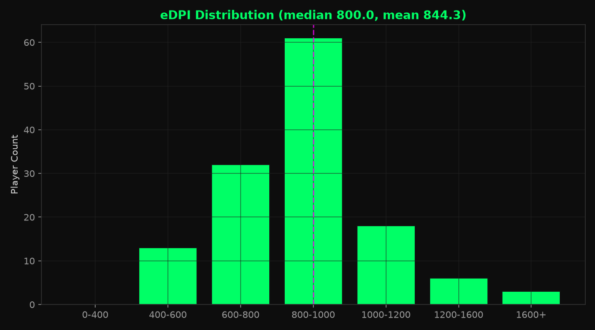
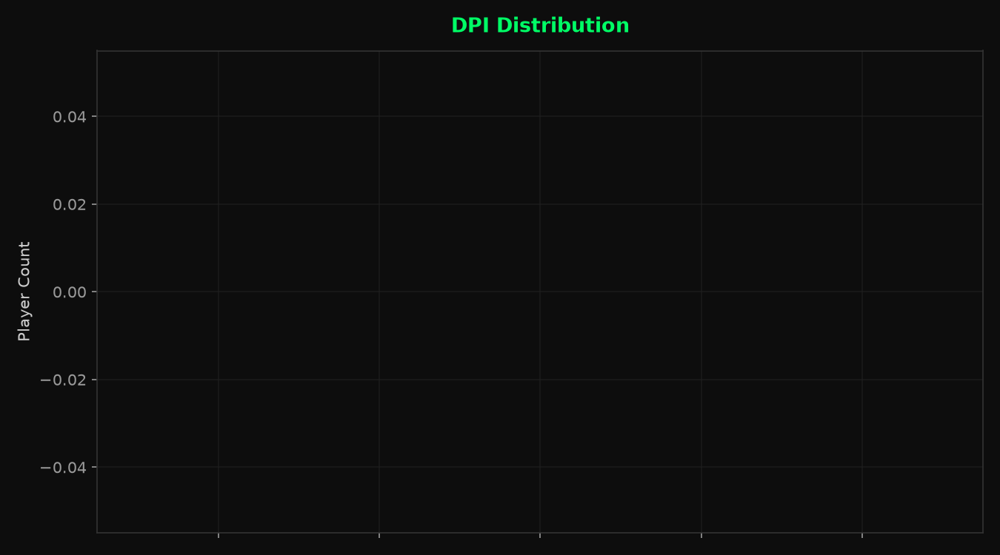
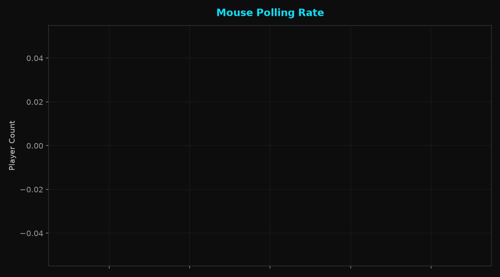
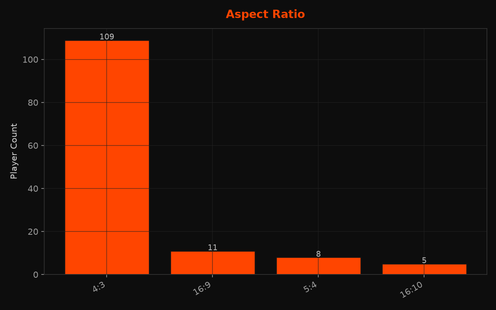
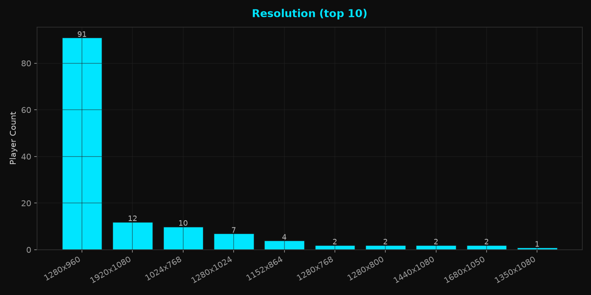
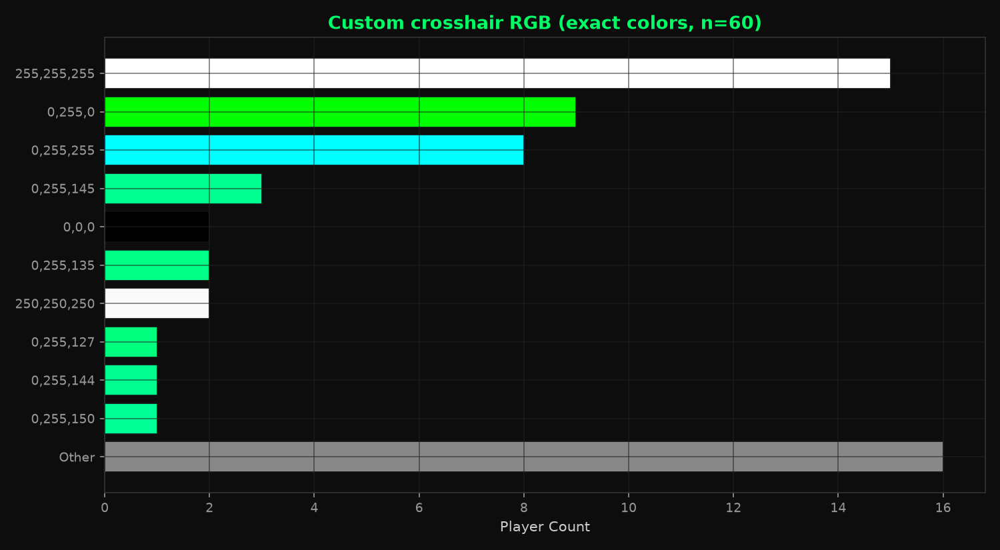
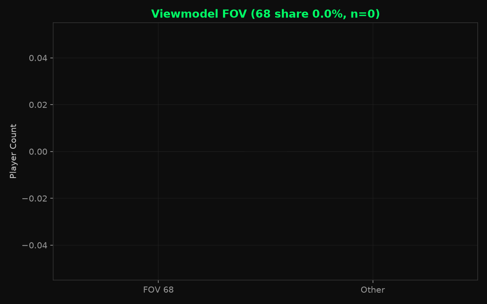

# CS2 Professional Settings Snapshot — 2026-08

[中文版](./latest.zh-CN.md)

2026-08-11 · VRS Top 30 (2026-08-10) · 30 teams · 149 players · 133/149 settings · `vrs-core-v2` baseline

## 1. Key numbers

- Median eDPI: **800** (n=133)
- DPI: 800 at 50.4% · 400 at 45.1% (n=133)
- 4:3: **82.0%** (n=133)
- 1280x960: **68.4%** (n=133)
- Polling: 1000 Hz at 62.4% · 4000 Hz+ at 18.0% (n=133)
- Crosshair: minimal at 80.5% · top color category Custom at 45.1% (n=133)
- `viewmodel_fov 68`: **91.2%** (n=125)
- Radar centered: 71.7% (n=120)

## 2. Mouse & sensitivity

### eDPI

- Median: **800** · Mean: **844.3** · n=133
- 600–1000 eDPI covers 69.9% of valid observations (93/133).

### DPI

- 800: **50.4%** · 400: 45.1% · 1600+: 3.8% (n=133)
- 400 + 800 DPI together: 127/133 (95.5%).

### Mouse polling rate

- 1000 Hz: 62.4% · 2000 Hz: 19.5% · 4000 Hz: 15.8% · 8000 Hz: 2.3% (n=133)
- 4000 Hz and above: 24/133 (18.0%).

## 3. Resolution & display

### Aspect ratio

- 4:3: **82.0%** (n=133)
- 16:9 is the next tier at 11/133 (8.3%).

### Resolution

- Most common: **1280x960** (68.4%, n=133)
- 1920x1080 is next at 12/133 (9.0%).

## 4. Crosshair

- Dot and Outline both disabled: **80.5%** (n=133)
- Color categories: Custom 45.1% · Cyan 26.3% · Green 22.6% · Yellow 6.0% (n=133)

- Custom RGB: **60/60** players with complete RGB (100.0%) · 26 unique exact colors · top **255,255,255** (25.0%)

## 5. Viewmodel

- `viewmodel_fov 68`: **91.2%** (n=125)
- Dominant offset: **X=2.5, Y=0, Z=-1.5**

## 6. Radar / Other

### Radar centered

- Enabled: 71.7% (n=120)

## 7. Extended segments

| Segment | Teams | Players | Median eDPI |
|---|---:|---:|---:|
| VRS ∩ HLTV Consensus | 27 | 134 | 800 |
| Ranked Union | 32 | 158 | 800 |
| Core + Watchlist | 33 | 163 | 800 |
| All tracked | 35 | 172 | 800 |

## 8. Data coverage

| Field | valid_n / cohort |
|---|---|
| eDPI | 133 / 149 |
| DPI | 133 / 149 |
| Resolution | 133 / 149 |
| Aspect ratio | 133 / 149 |
| Crosshair | 133 / 149 |
| Viewmodel FOV | 125 / 149 |
| Mouse polling rate | 133 / 149 |
| Monitor refresh rate | 0 / 149 |
| fps_max | 0 / 149 |
| Radar centered | 120 / 149 |
| Radar rotating | 0 / 149 |

133/149 Core players currently have at least one usable settings field.

## 9. Data & code

- Snapshot date: 2026-08-11
- Source: cs2settings
- Snapshot data: [`data/aggregate/2026-08.json`](../data/aggregate/2026-08.json)
- Project & methodology: [`README.md`](../README.md)
