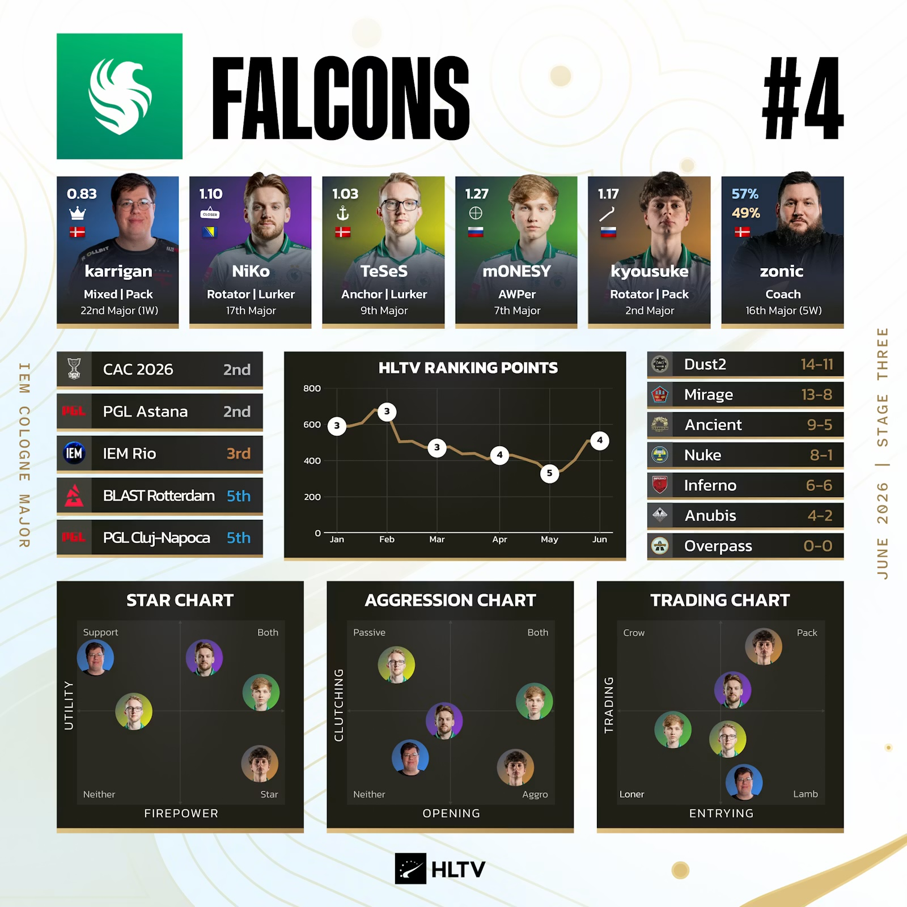
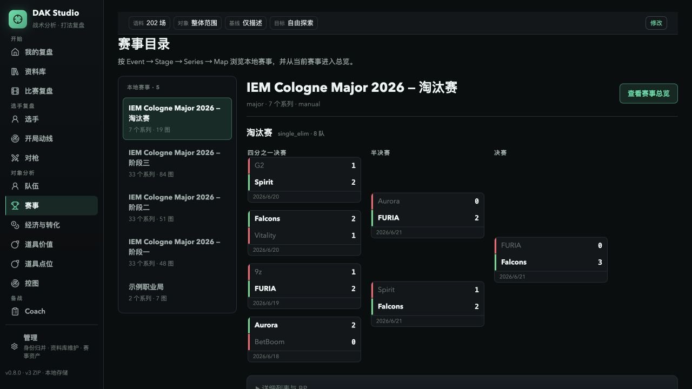

# CS2 职业选手设置统计第二期　打什么位置，真要换一套设置吗

今年 5 月，我第一次把职业选手设置完整统计了一遍。那次整理了 41 支队伍、198 名选手，最后得到了一套很明确的职业标准。800 左右的 eDPI、4:3 拉伸、1280×960、`viewmodel_fov 68`，再配一枚紧凑的小准星。对于不知道怎么调设置的玩家，我当时的建议很直接，先抄职业哥，再进服务器慢慢改。

三个月过去，我把这套数据重新跑了一遍。

八月这期换成了 2026 年 8 月 10 日 VRS 世界前 30，共追踪 149 名现役选手，其中 133 人有可用设置。结果没有什么大地震。eDPI 中位数仍是 800，93 人落在 600 到 1000；4:3 占 82.0%，1280×960 占 68.4%，拉伸比例占 89.5%。`viewmodel_fov 68` 的使用率到了 91.2%，133 人里有 107 人同时关掉中心点和准星轮廓。

一线赛场最常见的底盘还是那一套。你现在完全不知道从哪开始，800 eDPI、1.0 开镜灵敏度、4:3 拉伸和紧凑准星依然是我最推荐的起点。

【配图 1　八月 eDPI 分布。沿用第一期的直方图读法，标出 600 至 1000 区间和中位数 800，不加入 DPI。】

## 第一篇有一句话需要收回来

第一期里，我把 800 DPI 的份额变化写成了它正在加速取代 400 DPI。现在回头看，这个判断站不住。

五月用的是 HLTV Top 30 加额外邀请队，八月用的是 VRS 世界前 30。两期不是同一批人，两个百分比不能直接相减，更不能写成职业选手这三个月集体换了什么。400 DPI 和 800 DPI 本身也只是硬件档位，真正决定基础灵敏度的是它与游戏内 Sens 相乘后的 eDPI。八月仍然是 800 DPI 略多，67 人对 60 人，但这件事不值得继续当成设置答案的主角。

第一期写过的“绿色信仰崩塌”也有同样的问题。八月 Green 占 22.6%，与五月那期的 23.2% 很接近。当前能确认的是 Custom 已经成为最多的颜色，60 名 Custom 玩家里又以纯白最常见。谁从绿色换到了 Custom，手里还没有同一批选手的纵向记录。

所以这次常规设置就更新到这里。一线主流画像没换，八月这张快照会成为以后真正追踪变化的第一份固定基线。

我更想继续追第一期留下来的另一个问题。

## 职业选手会按位置配设置吗

第一期写雷达时，我猜过 0.4 可能更适合需要看全局的 IGL 或 Lurker，0.7 可能更多出现在 Anchor 身上。这个问题很像平时玩家会讨论的东西。AWPer 要不要更高的灵敏度，Lurker 会不会偏爱更细的准星，负责换防的人是不是需要另一套雷达。

真开始核数据，我先发现设置网站上的角色标签不太能用。

我把网站角色与 Cologne 赛事期间的 HLTV 标签逐个对过。118 名匹配选手里，23 人完全一致，23 人直接矛盾，另有 47 人只写了宽泛的 Rifler。雷达缩放 0.4 那条猜测也跟着翻了方向。按网站标签分时，32% 的 IGL 使用 0.4；换成赛事期 HLTV 角色后，这个比例只剩 8.3%，其他选手反而是 24.2%。第一期那段角色解释没有保留的理由。

HLTV 的赛事图卡会把同一名选手在 CT 和 T 方的职责分开写。以 Falcons 为例，NiKo 是 `Rotator | Lurker`，TeSeS 是 `Anchor | Lurker`，m0NESY 是 `AWPer`，kyousuke 是 `Rotator | Pack`。这种标签比一个笼统的 Rifler 好用，但它仍然是编辑给出的参考，不是服务器里的实际行为。

我需要再往下走一步，直接看选手在 demo 里怎么打。

## 这次把 202 份 Cologne demo 放进了 DAK

这批 demo 正好拿我最近一直在做的 DAK 跑了一遍。DAK 全名是 CS2 Demo Analysis Kit，是一套本地优先的 demo 分析产品。DAK Studio 可以直接导入 `.dem` 或 v3 ZIP，在本机整理赛事、看 2D 回放、选手档案和地图职责，分析结果还能点回具体回合。

这次导入的是 IEM Cologne Major 2026 四个阶段，共 202 份 demo，覆盖 32 队、160 名选手。DAK 现在已经能把位置、队形、AWP 持有和 CT 跨区移动这些行为整理出来，我就顺手拿它们继续问设置问题。

T 和 CT 必须分开看。T 方主要观察选手离队友有多远、独处时间、开局是否脱离大团、移动是否同步，以及 AWP 持有。CT 方再加入初始防区、跨区换防、率先响应和返回初始区域等行为。

这些数据里确实能看到熟悉的职责差异。T 方靠近团队、同步移动的选手更接近 `Pack`，长期远离队友和团队质心的选手更接近 `Lurker` 或 extremity。HLTV 标记的 `Rotator` 平均跨区换防比例是 33.5%，`Anchor` 是 19.4%。AWP 最容易核对，行为数据分出的 T 方 AWP 组 30 人全部对应 HLTV `AWPer`，CT 方也是 31/31。

我没有把这些标签当成五个硬格子。同一名选手会随地图和战术改变打法，步枪手之间也有大量重叠。这里更接近几条连续的行为轴，只是 `Pack`、`Lurker`、`Anchor` 和 `Rotator` 这些名字方便玩家理解。

## 行为分得出来，设置没有跟着分家

Cologne 行为、八月 VRS Core 和有效设置三者都齐的选手有 101 人。最终重跑前，我把想问的关系锁成三组。CT 换防与雷达，T 方独处程度与准星，AWP 职责与鼠标设置。

55 项主要关系里，没有一项通过多重比较校正。这个校正是为了防止一次检查很多关系时偶然撞中结果。再加上 19 项补充问题，预先列好的 74 项关系里最后只剩 1 项，也就是 CT 平均跨区移动耗时与雷达居中。

这串数字听着很干，换成玩家能直接用的话就简单多了。我没有找到 `AWPer` 专用灵敏度、`Lurker` 专用准星，也没有找到 `Anchor` 和 `Rotator` 各自一套雷达参数。

T 方独处程度与准星一共检查了 24 组关系。Size、Gap、Thickness、Alpha、中心点和轮廓都没有随着独处程度排出稳定规律。第一轮探索时出现过的 Alpha 200 弱信号，这次也没有回来。

【配图 2　T 方独处程度与准星参数。使用少量代表参数展示数据重叠，不放检验术语和结论标题。】

## 打狙不需要另外找一套基础灵敏度

AWPer 是我最想认真看的例子。玩家对打狙的灵敏度一直有两套说法。有人需要高敏快速转身和甩枪，也有人把低敏当成细调准星的前提。开镜灵敏度看起来更应该与 AWP 职责直接相关。

这批数据没有给出统一方向。选手持有 AWP 的比例与基础 eDPI 没有稳定关系，和设置页记录的 Zoom Sensitivity 也没有稳定关系。行为分组里的高敏、低敏和 800 eDPI 混在一起，没有单独排成一支 AWPer 队伍。

【配图 3　AWP 使用比例与 eDPI、Zoom Sensitivity。保留每名选手的点和 800、1.0 参考线，让重叠自己说明结果。】

这不影响我继续推荐 800 eDPI 和 1.0 开镜。理由正好更简单。这两项本来就是一线选手最集中的选择，而 Cologne 的行为数据没有给出一套更值得 AWPer 单独照抄的方案。你打狙，不需要先把基础设置推翻重来。

准星也是一样。职业选手普遍使用紧凑、无中心点、无轮廓的准星，`Pack` 和 `Lurker` 并没有在这套通用标准上分出两条路。先抄通用答案，比到处寻找所谓的 Lurker 专用准星靠谱。

## 唯一留下的雷达线索

93 名雷达居中数据有效的选手里，平均跨区移动耗时较短的一组有 40/45 开启雷达居中，耗时较长的一组是 29/48。逐队排除和扩大样本后，方向都没有变化。

这项耗时不能直接叫回防时间。它记录的是选手离开初始区域后，到达另一个稳定位置用了多久。HLTV 标记的 Anchor 跨区更少，一旦离开主防区域，平均要用 8.14 秒到达稳定位置；Rotator 更常做短程转移，平均是 5.94 秒。长短首先受初始站位和移动距离影响，也会带进主防、协防的职责差异，不能拿来比较谁回防更快。

我暂时不会把它写成雷达设置的岗位答案。长耗时组选雷达居中的比例反而更低，也不支持“主防更关注自己防区，所以更爱居中”这套直觉。只看至少打过 15 张地图的选手时，方向还在，证据已经减弱到很勉强。这条线索值得换一届赛事再看，现在为了它改雷达还太早。

## 一线标准可以继续抄，岗位不用另起一套

职业选手在服务器里的职责差异很真实。`AWPer`、`Pack`、`Lurker`、`Anchor` 和 `Rotator` 的行为都不一样，但个人设置没有跟着这些职责分成几套整齐方案。

所以如果你只是想搭一套最接近一线赛场的设置，我仍然建议直接从主流答案开始。800 eDPI、1.0 开镜、4:3 拉伸、1280×960、`viewmodel_fov 68`、X=2.5/Y=0/Z=-1.5、1000 Hz 回报率，再配一枚紧凑且关闭中心点和轮廓的准星。这些参数分别都是一线样本里最常见或最集中的选择，这次也没有看到哪个职责需要另起一套。拿它们搭一份普通玩家的默认模板，完全够格。

先照着搭起来。等你能明确说出自己遇到的是转身不够、远点太糊、枪模挡视野，还是准星在某张图里看不清，再动对应的参数。单凭自己打狙、断后、主防还是协防，没有必要先换一整套设置。

## 数据说明

设置快照日期为 2026 年 8 月 11 日，追踪范围使用 2026 年 8 月 10 日 VRS 世界前 30。行为数据来自 IEM Cologne Major 2026 的 202 份 demo。设置与赛事行为并非同一时点，本文只报告汇总结果，不公开逐选手交叉表。

八月快照是第一份 `vrs-core-v2` 固定基线，下一张同口径快照出来以后，才能追踪同一批选手改了什么。职责与设置的关系也需要另一届赛事独立复查。

项目、数据口径和月度报告均保存在 GitHub 的 `CS2-Pro-Settings` 仓库。DAK 的产品与 demo 分析代码保存在 `cs2-demo-analysis-kit`。
